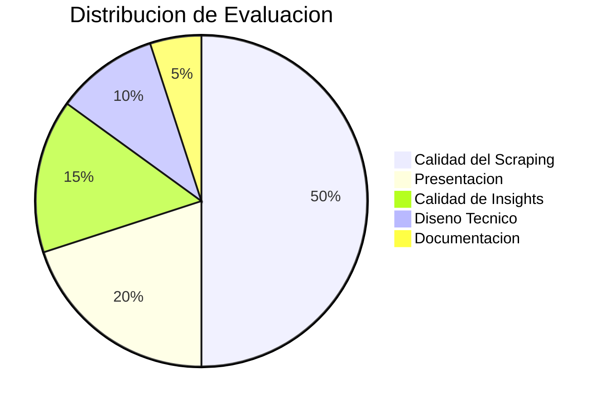

# 01 - Resumen del Requerimiento

## Caso Tecnico: Sistema de Competitive Intelligence para Rappi

**Rol:** AI Engineer  
**Tiempo:** 2 dias calendario  
**Presentacion:** 30 min (20 min presentacion + 10 min Q&A)

---

## Problema Central

Rappi **no tiene visibilidad sistematica** de como se compara con la competencia en variables criticas: precios, tiempos de entrega, fees y promociones. Los equipos de Pricing, Operations y Strategy toman decisiones **sin datos actualizados**.

### Preguntas que el sistema debe responder:
1. Somos mas caros o baratos que la competencia en cada zona?
2. Nuestros tiempos de entrega son competitivos?
3. Como se comparan nuestros service fees?
4. Que promociones esta corriendo la competencia?

---

## Entregables (2 componentes)

### 2.1 Sistema de Scraping Competitivo (70% del peso)

```
PESO EN EVALUACION: 70%
```

| Requisito | Detalle |
|-----------|---------|
| **Plataformas** | Rappi (baseline) + Uber Eats + DiDi Food (minimo) |
| **Direcciones** | 20-50 direcciones representativas en Mexico |
| **Metricas (min 3)** | Precio producto, Delivery Fee, Service Fee, Tiempo entrega, Descuentos, Disponibilidad, Precio final |
| **Productos referencia** | Big Mac/Whopper, Combo mediano, Nuggets, Coca-Cola 500ml, Agua 1L, Panales |
| **Output** | CSV o JSON estructurado |
| **Automatizacion** | Ejecutable con un comando/script |

**Bonus (no obligatorio):**
- Multiples verticales (restaurantes + retail + pharmacy)
- Comparacion mismo restaurante en diferentes plataformas
- Capturas automaticas de pantalla como evidencia

### 2.2 Informe de Insights Competitivos (30% del peso)

```
PESO EN EVALUACION: 30%
```

| Requisito | Detalle |
|-----------|---------|
| **Analisis** | Posicionamiento precios, ventaja operacional, estructura fees, estrategia promocional, variabilidad geografica |
| **Top 5 Insights** | Cada uno con: Finding + Impacto + Recomendacion |
| **Visualizaciones** | Minimo 3 graficos (barras, tablas, heatmaps) |
| **Formato** | PDF, PowerPoint, Notion o dashboard interactivo |

---

## Criterios de Evaluacion



| Criterio | Peso | Que evaluan |
|----------|------|-------------|
| Calidad del Scraping | 50% | Completitud de datos, manejo de errores, robustez |
| Presentacion | 20% | Claridad en demo y comunicacion de findings |
| Calidad de Insights | 15% | Relevancia, profundidad, accionabilidad |
| Diseno Tecnico | 10% | Arquitectura, herramientas, escalabilidad |
| Documentacion | 5% | Claridad instrucciones, reproducibilidad |

---

## Perfil del Candidato Excepcional

- **Pragmatismo:** Scope bien definido (no scrapear todo)
- **Pensamiento estrategico:** Insights que mueven la aguja del negocio
- **Resiliencia tecnica:** Manejo de casos edge (bloqueos, productos no disponibles)
- **Business acumen:** Entender que metricas importan y por que

---

## Estructura de Presentacion Sugerida

```
1. Approach y scope .............. 3 min
2. Demo del sistema .............. 7 min
3. Datos recolectados ............ 3 min
4. Top 5 Insights ............... 10 min
5. Decisiones tecnicas ........... 4 min
6. Limitaciones y next steps ..... 3 min
7. Q&A .......................... 10 min
```

---

## Restricciones y Consideraciones

- **Etica:** Respetar robots.txt, rate limiting, User-Agents apropiados
- **Legal:** Scraping de datos publicos es generalmente legal para analisis competitivo
- **Plan B:** Tener datos pre-scrapeados para la presentacion
- **Costo:** Soluciones cost-effective son mas valoradas
- **Reproducibilidad:** El equipo evaluador debe poder ejecutar el sistema

---

## Mapa Mental del Requerimiento

```
Sistema Competitive Intelligence
|
|-- [70%] SCRAPING
|   |-- Plataformas: Rappi + UberEats + DiDi Food
|   |-- Cobertura: 20-50 direcciones Mexico
|   |-- Metricas: precios, fees, tiempos, promos
|   |-- Productos: fast food estandar + retail
|   |-- Output: CSV/JSON
|   +-- Automatizado: 1 comando
|
|-- [30%] INSIGHTS
|   |-- Analisis comparativo 5 dimensiones
|   |-- Top 5 insights accionables
|   |-- Min 3 visualizaciones
|   +-- Formato ejecutivo
|
+-- EVALUACION
    |-- 50% Calidad scraping
    |-- 20% Presentacion
    |-- 15% Insights
    |-- 10% Diseno tecnico
    +-- 5% Documentacion
```
