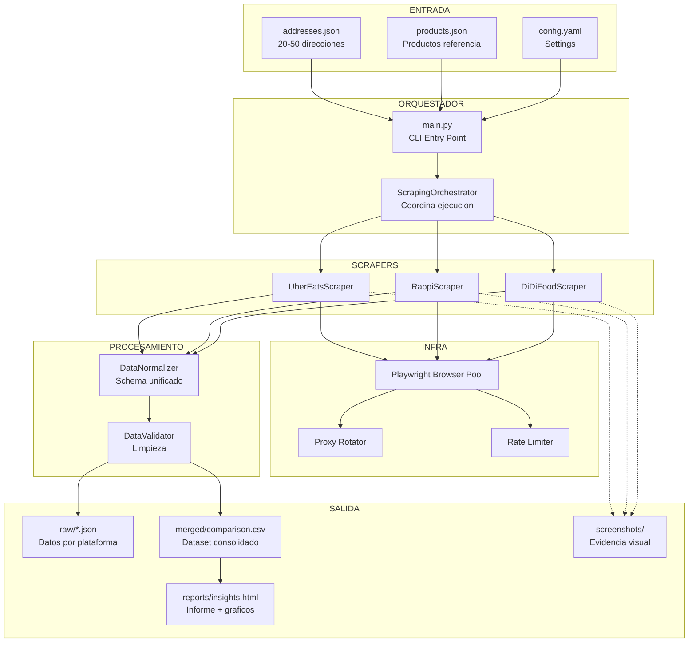
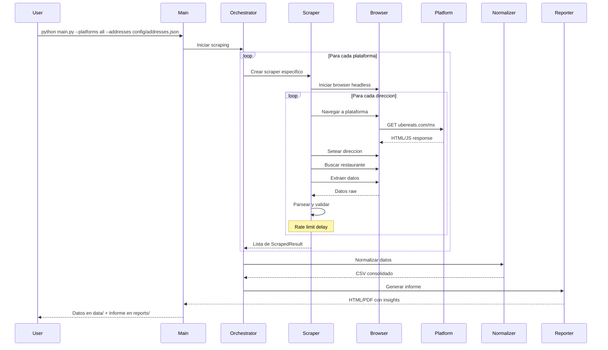

# 05 - Arquitectura Propuesta

## Diagrama General del Sistema



---

## Estructura de Directorios

```
SistemaCompetitiveIntelligence/
|
|-- Analisis/                          # Documentos de analisis (estos MDs)
|
|-- src/                               # Codigo fuente
|   |-- scrapers/
|   |   |-- __init__.py
|   |   |-- base.py                    # BaseScraper: clase abstracta
|   |   |-- uber_eats.py              # UberEatsScraper
|   |   |-- rappi.py                   # RappiScraper
|   |   |-- didi_food.py              # DiDiFoodScraper
|   |
|   |-- models/
|   |   |-- __init__.py
|   |   |-- schemas.py                 # Dataclasses: ScrapedItem, ScrapedResult
|   |
|   |-- processors/
|   |   |-- __init__.py
|   |   |-- normalizer.py             # Normaliza datos entre plataformas
|   |   |-- validator.py              # Valida y limpia datos
|   |   |-- merger.py                 # Merge a CSV consolidado
|   |
|   |-- analysis/
|   |   |-- __init__.py
|   |   |-- insights.py               # Generador de insights
|   |   |-- visualizations.py         # Graficos matplotlib/plotly
|   |   |-- report_generator.py       # Genera HTML/PDF final
|   |
|   |-- utils/
|   |   |-- __init__.py
|   |   |-- proxy.py                   # Rotacion de proxies
|   |   |-- rate_limiter.py           # Control de rate
|   |   |-- logger.py                  # Logging configurado
|   |   |-- screenshot.py             # Capturas de pantalla
|   |
|   |-- config.py                      # Carga configuracion
|   |-- main.py                        # Entry point CLI
|
|-- config/
|   |-- addresses.json                 # Direcciones a scrapear
|   |-- products.json                  # Productos de referencia
|   |-- settings.yaml                  # Configuracion general
|
|-- data/
|   |-- raw/                           # JSON por scraping run
|   |-- merged/                        # CSV consolidado
|   |-- screenshots/                   # Capturas de pantalla
|
|-- reports/
|   |-- insights_report.html           # Informe final
|   |-- charts/                        # Imagenes de graficos
|
|-- notebooks/
|   |-- analysis.ipynb                 # Notebook de analisis exploratorio
|
|-- tests/
|   |-- test_scrapers.py
|   |-- test_normalizer.py
|
|-- requirements.txt
|-- README.md
|-- .env.example                       # Variables de entorno (proxies, etc)
|-- run.sh                             # Script de ejecucion rapida
```

---

## Diseno de Clases

### BaseScraper (Clase Abstracta)

```python
class BaseScraper(ABC):
    """Clase base para todos los scrapers de delivery platforms."""
    
    def __init__(self, config: ScraperConfig):
        self.config = config
        self.browser = None
        self.results: list[ScrapedResult] = []
    
    async def setup(self):
        """Inicializa browser con stealth settings."""
        
    async def teardown(self):
        """Cierra browser y limpia recursos."""
    
    @abstractmethod
    async def set_address(self, address: Address) -> bool:
        """Configura la direccion de entrega en la plataforma."""
    
    @abstractmethod
    async def search_restaurant(self, name: str) -> bool:
        """Busca un restaurante especifico."""
    
    @abstractmethod
    async def extract_items(self, product_names: list[str]) -> list[ScrapedItem]:
        """Extrae precios de los productos de referencia."""
    
    @abstractmethod
    async def extract_fees(self) -> FeeInfo:
        """Extrae delivery fee, service fee, etc."""
    
    @abstractmethod
    async def extract_delivery_time(self) -> TimeEstimate:
        """Extrae tiempo estimado de entrega."""
    
    async def scrape_address(self, address: Address, products: list[str]) -> ScrapedResult:
        """Flujo completo para una direccion."""
        await self.set_address(address)
        await self.search_restaurant("McDonald's")
        items = await self.extract_items(products)
        fees = await self.extract_fees()
        time_est = await self.extract_delivery_time()
        return ScrapedResult(address=address, items=items, fees=fees, time=time_est)
    
    async def run(self, addresses: list[Address], products: list[str]) -> list[ScrapedResult]:
        """Ejecuta scraping para todas las direcciones."""
        await self.setup()
        for addr in addresses:
            try:
                result = await self.scrape_address(addr, products)
                self.results.append(result)
                await asyncio.sleep(self.config.delay_between_requests)
            except Exception as e:
                logger.error(f"Error scraping {addr}: {e}")
        await self.teardown()
        return self.results
```

### Modelos de Datos

```python
@dataclass
class Address:
    label: str          # "Reforma 222, Centro"
    lat: float          # 19.4326
    lng: float          # -99.1332
    zone_type: str      # "centro" | "residencial" | "periferia"

@dataclass
class ScrapedItem:
    name: str           # "Big Mac"
    price: float        # 89.00
    currency: str       # "MXN"
    available: bool     # True
    original_name: str  # Nombre como aparece en la plataforma

@dataclass
class FeeInfo:
    delivery_fee: float | None
    service_fee: float | None
    small_order_fee: float | None
    promotions: list[str]

@dataclass  
class TimeEstimate:
    min_minutes: int | None
    max_minutes: int | None
    
@dataclass
class ScrapedResult:
    platform: str
    address: Address
    restaurant: str
    items: list[ScrapedItem]
    fees: FeeInfo
    time: TimeEstimate
    timestamp: str
    screenshot_path: str | None
    success: bool
    error_message: str | None
```

---

## Flujo de Ejecucion



---

## Configuracion de Direcciones (addresses.json)

```json
{
  "addresses": [
    {
      "label": "Reforma 222 - Centro Historico",
      "lat": 19.4326,
      "lng": -99.1332,
      "zone_type": "centro",
      "city": "CDMX"
    },
    {
      "label": "Polanco - Zona Premium",
      "lat": 19.4340,
      "lng": -99.1956,
      "zone_type": "premium",
      "city": "CDMX"
    },
    {
      "label": "Coyoacan - Residencial",
      "lat": 19.3467,
      "lng": -99.1617,
      "zone_type": "residencial",
      "city": "CDMX"
    },
    {
      "label": "Iztapalapa - Periferia",
      "lat": 19.3586,
      "lng": -99.0575,
      "zone_type": "periferia",
      "city": "CDMX"
    },
    {
      "label": "Santa Fe - Corporativo",
      "lat": 19.3663,
      "lng": -99.2586,
      "zone_type": "corporativo",
      "city": "CDMX"
    }
  ]
}
```

### Justificacion de zonas

```
CDMX - Diversidad de zonas:
|
|-- Centro/Turismo  --> Alta demanda, muchos restaurantes, alta competencia
|-- Premium/Polanco --> Tickets altos, usuarios price-insensitive
|-- Residencial     --> Volumen constante, usuarios regulares
|-- Periferia       --> Baja cobertura, menos competencia, posible expansion
|-- Corporativo     --> Hora pico almuerzo, delivery rapido importa mas
|
|-- Otras ciudades (si hay tiempo):
    |-- Monterrey (2-3 direcciones)
    |-- Guadalajara (2-3 direcciones)
```

---

## CLI Interface

```bash
# Ejecucion completa (todas las plataformas, todas las direcciones)
python main.py

# Solo una plataforma
python main.py --platform uber_eats

# Solo algunas direcciones
python main.py --addresses config/addresses_small.json

# Generar solo el informe (con datos existentes)
python main.py --report-only --data data/merged/latest.csv

# Con screenshots
python main.py --screenshots

# Modo debug (1 direccion, verbose logging)
python main.py --debug
```

---

## Consideraciones Tecnicas

### Anti-Detection
```yaml
stealth_config:
  # Playwright stealth settings
  webdriver_flag: false
  chrome_headless: "new"      # Nuevo modo headless de Chrome
  user_agent: "Mozilla/5.0 (Windows NT 10.0; Win64; x64) Chrome/124.0"
  viewport: { width: 1920, height: 1080 }
  locale: "es-MX"
  timezone: "America/Mexico_City"
  geolocation: true            # Simular ubicacion real

proxy_config:
  enabled: false               # Activar si hay bloqueos
  provider: "scraperapi"       # o "brightdata", "oxylabs"
  rotate: true
  country: "MX"
```

### Rate Limiting
```yaml
rate_limiting:
  delay_between_requests: 3-7s    # Random delay
  delay_between_addresses: 5-10s  # Cambio de direccion
  max_requests_per_minute: 10
  max_concurrent_browsers: 1      # Secuencial por seguridad
```

### Error Handling
```
Niveles de retry:
  1. Retry mismo request (max 2 veces)
  2. Retry con proxy diferente
  3. Retry con browser nuevo
  4. Log error y continuar con siguiente direccion
  5. Si >50% falla: alertar y pausar
```
