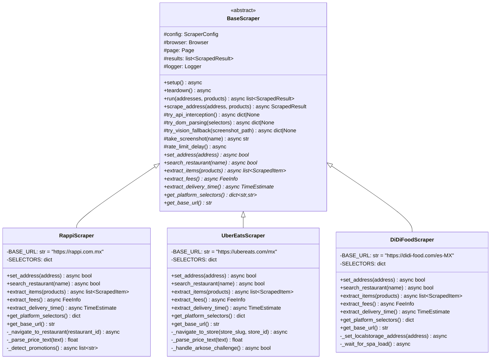
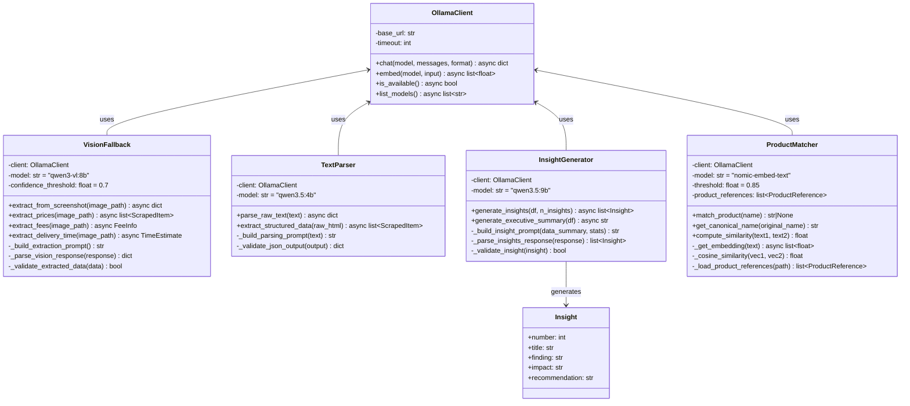
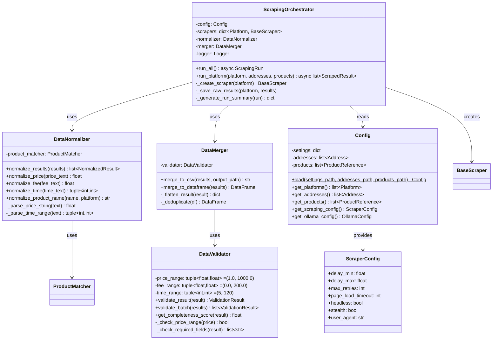
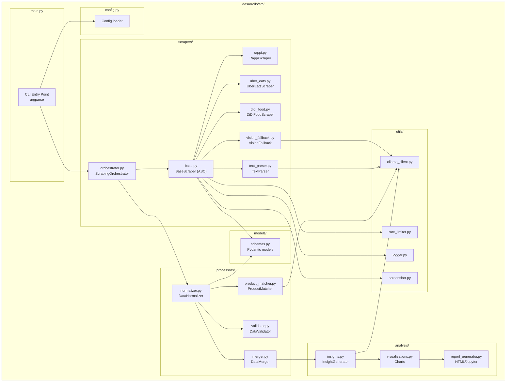

# Diagrama de Componentes y Clases

## 1. Diagrama de Clases: Scrapers



---

## 2. Diagrama de Clases: IA Components



---

## 3. Diagrama de Clases: Procesamiento y Orquestacion



---

## 4. Diagrama de Paquetes



---

## 5. Interfaces y Metodos Abstractos

### BaseScraper - Contrato que cada plataforma implementa

```python
from abc import ABC, abstractmethod

class BaseScraper(ABC):
    """Contrato para scrapers de plataformas de delivery.
    
    Cada scraper implementa las 3 capas de recoleccion:
    - Capa 1: API interception (logica comun en base)
    - Capa 2: DOM parsing (selectores especificos por plataforma)
    - Capa 3: Vision fallback (logica comun en base con VisionFallback)
    """

    @abstractmethod
    async def set_address(self, address: Address) -> bool:
        """Configura la direccion de entrega en la plataforma.
        
        Returns:
            True si la direccion fue aceptada, False si no hay cobertura.
        """
        ...

    @abstractmethod
    async def search_restaurant(self, name: str) -> bool:
        """Navega al restaurante especificado.
        
        Returns:
            True si el restaurante fue encontrado y la pagina cargo.
        """
        ...

    @abstractmethod
    async def extract_items(self, product_names: list[str]) -> list[ScrapedItem]:
        """Extrae precios de los productos de referencia.
        
        Args:
            product_names: Lista de nombres canonicos a buscar.
        
        Returns:
            Lista de ScrapedItem con precios encontrados.
        """
        ...

    @abstractmethod
    async def extract_fees(self) -> FeeInfo:
        """Extrae delivery fee y promociones visibles.
        
        Note:
            Service fee NO es accesible sin simular compra (ver ADR-003).
        """
        ...

    @abstractmethod
    async def extract_delivery_time(self) -> TimeEstimate:
        """Extrae tiempo estimado de entrega.
        
        Note:
            Uber Eats requiere direccion configurada para mostrar tiempos.
            Rappi muestra tiempos sin direccion.
        """
        ...

    @abstractmethod
    def get_platform_selectors(self) -> dict[str, str]:
        """Retorna diccionario de selectores CSS especificos de la plataforma.
        
        Returns:
            {"product_name": "css_selector", "price": "css_selector", ...}
        """
        ...

    @abstractmethod
    def get_base_url(self) -> str:
        """URL base de la plataforma."""
        ...
```

### Conexiones entre Componentes

```
FLUJO DE DEPENDENCIAS:
═══════════════════════

main.py
  └─→ Config.load() ─────────────→ addresses.json, products.json, settings.yaml
  └─→ ScrapingOrchestrator(config)
        ├─→ RappiScraper(config)
        │     ├─→ Playwright Browser (stealth)
        │     ├─→ VisionFallback(OllamaClient) ── qwen3-vl:8b
        │     ├─→ TextParser(OllamaClient) ─────── qwen3.5:4b
        │     ├─→ RateLimiter
        │     ├─→ Screenshot
        │     └─→ Logger
        ├─→ UberEatsScraper(config)  [mismas dependencias]
        ├─→ DiDiFoodScraper(config)  [mismas dependencias]
        │
        ├─→ DataNormalizer
        │     └─→ ProductMatcher(OllamaClient) ── nomic-embed-text
        ├─→ DataValidator
        └─→ DataMerger
              └─→ comparison.csv
                    │
                    v
              InsightGenerator(OllamaClient) ──── qwen3.5:9b
                    │
                    v
              Visualizations (matplotlib/plotly)
                    │
                    v
              ReportGenerator → reports/insights.html
```
