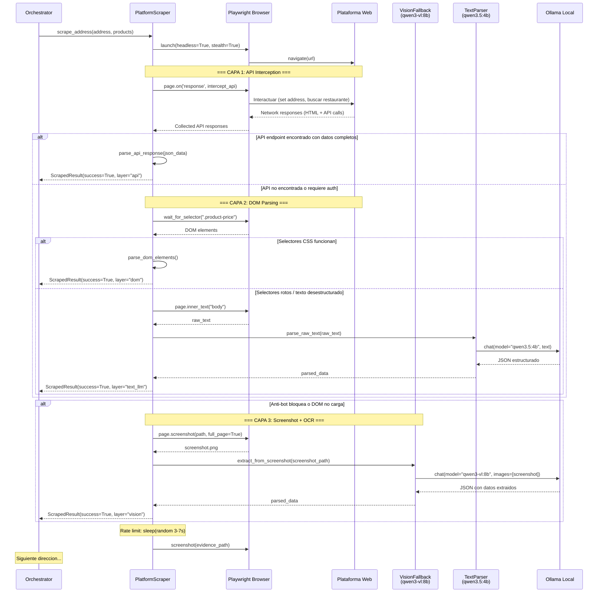
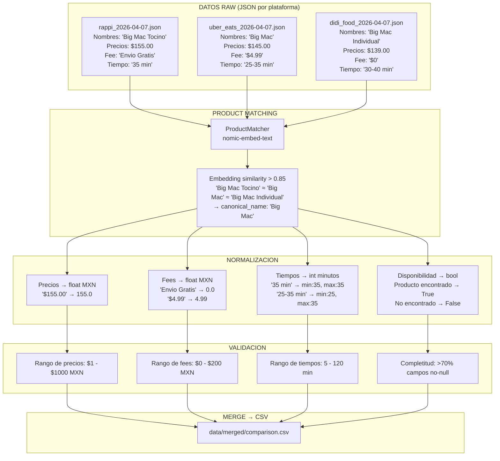
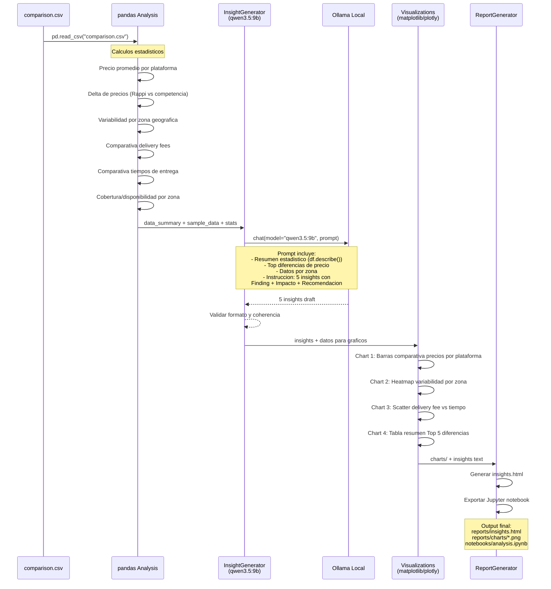
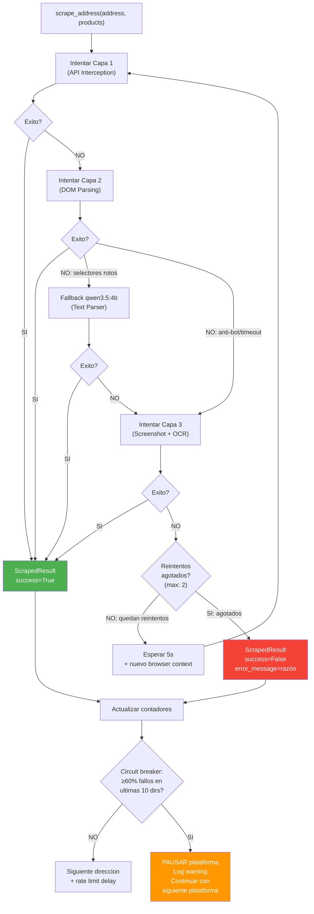
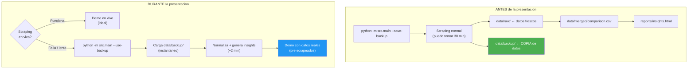

# Flujo de Datos

## 1. Diagrama de Secuencia: Scraping de 1 Direccion en 1 Plataforma



---

## 2. Diagrama del Flujo de Fallback entre las 3 Capas

```mermaid
graph TB
    START["Iniciar scraping<br/>para 1 direccion"] --> NAV["Playwright navega<br/>a la plataforma"]
    
    NAV --> SET_ADDR["Configurar direccion<br/>de entrega"]
    SET_ADDR --> SEARCH["Buscar restaurante<br/>(McDonald's)"]
    
    SEARCH --> LISTEN["Activar network<br/>listener"]
    
    LISTEN --> L1{"CAPA 1<br/>API endpoint<br/>encontrado?"}
    
    L1 -->|"SI: JSON limpio"| L1_PARSE["Parsear response<br/>API directa"]
    L1_PARSE --> L1_VALID{"Datos<br/>completos?"}
    L1_VALID -->|"SI"| SUCCESS["ScrapedResult<br/>success=True"]
    L1_VALID -->|"NO: faltan campos"| L2_START
    
    L1 -->|"NO: sin endpoint util"| L2_START["CAPA 2<br/>Intentar DOM parsing"]
    
    L2_START --> L2_WAIT["wait_for_selector<br/>timeout=10s"]
    L2_WAIT --> L2{"Selectores<br/>CSS funcionan?"}
    
    L2 -->|"SI: elementos encontrados"| L2_PARSE["Extraer datos<br/>del DOM"]
    L2_PARSE --> L2_VALID{"Datos<br/>completos?"}
    L2_VALID -->|"SI"| SUCCESS
    L2_VALID -->|"NO: texto roto"| L2_LLM["qwen3.5:4b<br/>parsea texto crudo"]
    L2_LLM --> L2_LLM_VALID{"Datos<br/>extraidos?"}
    L2_LLM_VALID -->|"SI"| SUCCESS
    L2_LLM_VALID -->|"NO"| L3_START
    
    L2 -->|"NO: timeout/anti-bot"| L3_START["CAPA 3<br/>Screenshot + OCR"]
    
    L3_START --> L3_SHOT["page.screenshot()<br/>captura pagina"]
    L3_SHOT --> L3_OCR["qwen3-vl:8b<br/>OCR inteligente"]
    L3_OCR --> L3{"Datos<br/>extraidos?"}
    
    L3 -->|"SI"| SUCCESS
    L3 -->|"NO: pagina vacia/error"| FAIL["ScrapedResult<br/>success=False<br/>error_message logged"]
    
    SUCCESS --> SAVE["Guardar en<br/>data/raw/{platform}_{timestamp}.json"]
    FAIL --> SAVE
    SAVE --> NEXT["Siguiente direccion<br/>+ rate limit delay"]

    style L1 fill:#4CAF50,color:#fff
    style L2 fill:#FF9800,color:#fff
    style L3 fill:#F44336,color:#fff
    style SUCCESS fill:#2196F3,color:#fff
    style FAIL fill:#9E9E9E,color:#fff
```



---

## 3. Flujo de Normalizacion: 3 Plataformas → 1 CSV



### Columnas del CSV Consolidado

```
comparison.csv
═══════════════════════════════════════════════════════════════════════════
timestamp | platform | address_label | zone_type | city | restaurant |
canonical_product | original_product_name | price_mxn | available |
delivery_fee_mxn | service_fee_mxn | delivery_time_min | delivery_time_max |
promotions | rating | scrape_layer | screenshot_path
```

---

## 4. Flujo de Generacion de Insights con LLM



### Estructura del Prompt para qwen3.5:9b

```
SYSTEM:
  Eres un analista senior de competitive intelligence para Rappi Mexico.
  Genera insights accionables basados en datos reales de scraping.
  Responde en espanol. Se especifico con numeros y porcentajes.

USER:
  Datos comparativos de precios de delivery en CDMX.
  
  RESUMEN ESTADISTICO:
  {df.describe().to_string()}
  
  TOP DIFERENCIAS DE PRECIO:
  {top_price_deltas}
  
  DATOS POR ZONA:
  {zone_analysis}
  
  Genera exactamente 5 insights con este formato:
  
  ### Insight #N: [Titulo corto y accionable]
  **Finding:** [Dato especifico con numeros del dataset]
  **Impacto:** [Por que importa para Rappi, cuantificado si es posible]
  **Recomendacion:** [Accion concreta que el equipo puede tomar]
```

---

## 5. Estrategia de Error Handling y Retry

### Diagrama de Retry por Direccion



### Niveles de Retry

```
NIVEL 1: Retry dentro de la misma capa
  - Timeout de pagina → retry 1 vez con +5s de timeout
  - Selector no encontrado → retry 1 vez despues de 2s
  - Error de red → retry 1 vez despues de 3s

NIVEL 2: Escalamiento entre capas
  - Capa 1 falla → Capa 2 (sin retry, cambio de estrategia)
  - Capa 2 falla → Capa 2 LLM fallback (sin retry)
  - Capa 2 LLM falla → Capa 3 (sin retry, cambio de estrategia)
  - Capa 3 falla → reintentar todo el ciclo (NIVEL 3)

NIVEL 3: Retry completo de la direccion
  - Si las 3 capas fallan → esperar 5s, nuevo browser context
  - Max 2 reintentos completos por direccion
  - Si agota reintentos → ScrapedResult(success=False), continuar

NIVEL 4: Circuit breaker por plataforma
  - Ventana: ultimas 10 direcciones intentadas
  - Umbral: ≥60% fallos (6 de 10 fallidas)
  - Accion: pausar esa plataforma, log WARNING, continuar con la siguiente
  - NO abortar todo el run: las otras plataformas pueden funcionar
```

### Manejo de Errores Especificos

| Error | Capa | Accion | Retry? |
|-------|------|--------|--------|
| `TimeoutError` (pagina no carga) | 1, 2 | Retry con +5s timeout | Si (1 vez) |
| `Selector not found` | 2 | Escalar a LLM fallback | No (cambio de capa) |
| Arkose/CAPTCHA detectado | 2 | Escalar a Capa 3 | No |
| `ConnectionError` (red) | 1, 2 | Retry despues de 3s | Si (1 vez) |
| Ollama no disponible | 2 (LLM), 3 | Saltar esa capa | No |
| Screenshot vacio/negro | 3 | Retry con 2s delay | Si (1 vez) |
| JSON invalido de LLM | 2 (LLM), 3 | Retry prompt con formato mas estricto | Si (1 vez) |
| Restaurante no encontrado | Todas | `ScrapedResult(success=False, error="not_found")` | No |
| Direccion sin cobertura | Todas | `ScrapedResult(success=False, error="no_coverage")` | No |
| HTTP 429 (rate limited) | 1 | Esperar 30s, luego retry | Si (1 vez) |
| HTTP 403 (forbidden) | 1 | Escalar a Capa 2 | No |

### Politica de "Nunca Descartar"

```
REGLA FUNDAMENTAL: Nunca descartar un ScrapedResult.

- success=True + datos completos → ideal
- success=True + datos parciales → incluir, marcar campos faltantes como null
- success=False → incluir en raw JSON con error_message, NO incluir en CSV final
  PERO si tiene datos parciales (ej: precio encontrado pero no fee) → incluir lo que hay

El CSV final puede tener NULLs. Mejor datos incompletos que datos inventados.
pandas y el LLM de insights manejan NULLs correctamente.
```

### Logging de Errores

```python
# Formato de log para cada intento
logger.info(f"[{platform}][{address.label}] Layer {layer}: attempting...")
logger.info(f"[{platform}][{address.label}] Layer {layer}: SUCCESS ({duration:.1f}s)")
logger.warning(f"[{platform}][{address.label}] Layer {layer}: FAILED - {error_type}: {message}")
logger.warning(f"[{platform}][{address.label}] Retry {n}/2: escalating to Layer {next_layer}")
logger.error(f"[{platform}][{address.label}] ALL LAYERS FAILED after {retries} retries")
logger.error(f"[{platform}] CIRCUIT BREAKER: {fail_count}/10 failed, pausing platform")
```

### Resumen de Ejecucion

Al final de cada `ScrapingRun`, el orquestador genera un resumen:

```python
{
    "run_id": "abc123",
    "duration_seconds": 1847,
    "platforms": {
        "rappi": {
            "total": 25, "success": 23, "failed": 2,
            "layers": {"api": 15, "dom": 6, "vision": 2},
            "circuit_breaker_triggered": false
        },
        "uber_eats": {
            "total": 25, "success": 20, "failed": 5,
            "layers": {"api": 8, "dom": 2, "vision": 10},
            "circuit_breaker_triggered": false
        },
        "didi_food": {
            "total": 25, "success": 12, "failed": 13,
            "layers": {"api": 0, "dom": 0, "vision": 12},
            "circuit_breaker_triggered": true,
            "circuit_breaker_at_address": 15
        }
    },
    "total_data_points": 275,
    "overall_success_rate": 0.73
}

---

## 6. Estimacion de Tiempos de Ejecucion

### Desglose por Operacion

| Operacion | Tiempo estimado | Frecuencia | Notas |
|-----------|----------------|------------|-------|
| Browser startup | ~3s | 1 vez por plataforma | Playwright launch + stealth |
| Navegacion a pagina | ~3-5s | por direccion | page.goto + networkidle |
| Capa 1: API interception | ~2-3s | por direccion | Intercept + parse |
| Capa 2: DOM parsing | ~3-5s | si Capa 1 falla | wait_for_selector + extract |
| Capa 2 LLM fallback | ~3-5s | si selectores fallan | qwen3.5:4b inference |
| Capa 3: Screenshot + OCR | ~5-8s | si Capas 1-2 fallan | screenshot + qwen3-vl inference |
| Rate limit delay | ~3-7s (random) | entre cada direccion | Obligatorio |
| Delay entre direcciones | ~5-10s (random) | entre cada cambio de dir | Obligatorio |

### Escenario: Ejecucion Completa (25 dirs × 3 plataformas)

```
MODO SECUENCIAL (execution_mode: sequential)
═══════════════════════════════════════════

Por plataforma:
  Browser startup:     3s
  25 direcciones × (
    navegacion:        ~4s
    extraccion:        ~4s (promedio entre capas)
    rate limit:        ~5s
    delay direccion:   ~7s
  ) = 25 × 20s =       500s (~8.3 min)
  Browser teardown:    1s
  
  Total por plataforma: ~8.5 min

3 plataformas secuencial: ~25-30 min

Post-scraping:
  Product matching:    ~30s (embeddings cacheados)
  Normalizacion:       ~5s
  Merge CSV:           ~2s
  Insight generation:  ~60s (qwen3.5:9b)
  Visualizaciones:     ~10s
  Report HTML:         ~5s

TOTAL ESTIMADO: ~28-35 min (secuencial)
```

```
MODO PARALELO (execution_mode: parallel_platforms)
═══════════════════════════════════════════

3 browsers simultaneos (requiere ~4GB RAM extra):
  Cada plataforma: ~8.5 min
  Pero en paralelo: ~10 min (overhead de contexto switching)

Post-scraping: ~2 min (igual)

TOTAL ESTIMADO: ~12-15 min (paralelo)
```

### Escenarios Rapidos

```
--debug (1 dir, 1 plataforma):          ~30s
--max-addresses 3 (3 dirs, 3 plat):     ~3 min
--max-addresses 5 (5 dirs, 3 plat):     ~6 min
--platforms rappi (25 dirs, 1 plat):     ~10 min
--report-only (sin scraping):           ~2 min
--use-backup (sin scraping):            ~2 min
```

### Decision: Empezar Secuencial

Para MVP 0-1 usar `execution_mode: sequential`:
- Mas simple de implementar y debuggear
- Menos riesgo de deteccion (1 browser a la vez)
- ~30 min es aceptable para un run completo
- Paralelismo es optimizacion para MVP 2+ si se necesita

---

## 7. Estrategia de Datos Pre-Scrapeados (Backup para Demo)

### Problema

La presentacion es de 30 minutos. Si el scraping falla en vivo:
- No hay datos → no hay insights → no hay demo
- El evaluador ve un error en pantalla → mala impresion

### Solucion: Sistema de Backup con --save-backup y --use-backup



### Estructura de data/backup/

```
data/backup/
├── rappi_20260407_143000.json       # Raw JSON de Rappi
├── uber_eats_20260407_144500.json   # Raw JSON de Uber Eats
├── didi_food_20260407_150000.json   # Raw JSON de DiDi Food (si hay)
├── comparison.csv                    # CSV consolidado
└── backup_metadata.json             # Metadata del backup
```

### backup_metadata.json

```json
{
  "created_at": "2026-04-07T15:30:00",
  "platforms": ["rappi", "uber_eats"],
  "addresses_count": 25,
  "total_results": 50,
  "success_rate": 0.86,
  "notes": "DiDi Food excluido por circuit breaker"
}
```

### Flujo en main.py

```python
if args.use_backup:
    # Cargar datos pre-scrapeados
    raw_results = load_backup(config.paths.backup)
    if not raw_results:
        logger.error("No backup data found in data/backup/")
        sys.exit(3)
    logger.info(f"Loaded {len(raw_results)} results from backup")
    # Continuar con normalizacion e insights normalmente
    
elif args.save_backup:
    # Scraping normal
    raw_results = orchestrator.run_all()
    # Guardar backup
    save_backup(raw_results, config.paths.backup)
    logger.info(f"Backup saved to {config.paths.backup}")

# En ambos casos, el resto del pipeline es identico:
# normalize → merge → insights → report
```

### Estrategia para la Presentacion

```
DIA ANTES DE LA PRESENTACION:
  1. Correr scraping completo: python -m src.main --save-backup
  2. Verificar que data/backup/ tiene datos validos
  3. Verificar que reports/insights.html se genero correctamente
  4. Opcionalmente: correr --use-backup para confirmar que el flujo funciona

DURANTE LA PRESENTACION:
  Opcion A (ideal):
    - Demo en vivo con --debug (1 dir, 1 plataforma, ~30s)
    - Mostrar el scraping funcionando en tiempo real
    - Luego mostrar el reporte pre-generado con datos completos

  Opcion B (si el scraping falla en vivo):
    - "El scraping puede fallar por anti-bot, esto es esperado"
    - "Tengo datos pre-scrapeados de [fecha]"
    - python -m src.main --use-backup
    - Mostrar reporte generado con datos reales

  Opcion C (emergencia):
    - Abrir directamente reports/insights.html pre-generado
    - Explicar el sistema con diagramas de arquitectura
    - Datos estan ahi, solo el live scraping fallo

EN TODOS LOS CASOS: los datos son REALES, solo la frescura cambia.
```

---

## 8. Ciclo de Vida de Datos entre Runs

### Regla: Acumular, nunca sobrescribir

Cada ejecucion genera archivos con timestamp. Nada se sobrescribe.

### data/raw/ — JSON por plataforma y run

```
Naming: {platform}_{YYYY-MM-DD}_{HH-MM-SS}.json
Ejemplo:
  data/raw/rappi_2026-04-07_14-30-00.json
  data/raw/rappi_2026-04-07_18-45-00.json    ← segundo run, archivo nuevo
  data/raw/uber_eats_2026-04-07_14-45-00.json

Regla: NUNCA sobrescribir. Cada run crea un archivo nuevo.
Cleanup: manual. Los archivos viejos se acumulan.
         Para el scope de 2 dias no es problema.
```

### data/merged/ — CSV consolidado

```
Naming: comparison_{YYYY-MM-DD}_{HH-MM-SS}.csv
Symlink: comparison.csv → apunta al mas reciente

Ejemplo:
  data/merged/comparison_2026-04-07_14-50-00.csv
  data/merged/comparison_2026-04-07_18-55-00.csv  ← segundo run
  data/merged/comparison.csv → comparison_2026-04-07_18-55-00.csv

Regla: Cada run genera un CSV nuevo.
       comparison.csv (sin timestamp) siempre apunta al ultimo.
       --report-only lee comparison.csv (el mas reciente por defecto).
```

### data/screenshots/ — Evidencia visual

```
Naming: {platform}_{address_slug}_{YYYYMMDD}_{HHMMSS}.png
Ejemplo: rappi_reforma-222_20260407_143015.png

Regla: Acumular. No sobrescribir.
       El screenshot_path en ScrapedResult apunta al archivo exacto.
```

### reports/ — Reportes generados

```
Naming: insights_{YYYY-MM-DD}_{HH-MM-SS}.html
Symlink: insights.html → apunta al mas reciente

reports/charts/ se sobrescribe en cada run (son derivados, no datos).

Regla: El reporte siempre se puede regenerar con --report-only.
       Los charts son efimeros, los datos son permanentes.
```

### data/backup/ — Pre-scrapeados para demo

```
Regla: --save-backup SOBRESCRIBE el backup anterior.
       Solo hay 1 backup activo a la vez.
       Es el snapshot "golden" para la presentacion.
```

### Resumen

| Directorio | Comportamiento | Naming |
|------------|---------------|--------|
| `data/raw/` | Acumular | `{platform}_{timestamp}.json` |
| `data/merged/` | Acumular + symlink `comparison.csv` | `comparison_{timestamp}.csv` |
| `data/screenshots/` | Acumular | `{platform}_{address}_{timestamp}.png` |
| `reports/` | Acumular + symlink `insights.html` | `insights_{timestamp}.html` |
| `reports/charts/` | Sobrescribir | `price_comparison.png`, etc. |
| `data/backup/` | Sobrescribir (1 snapshot) | Mismo naming que raw |
