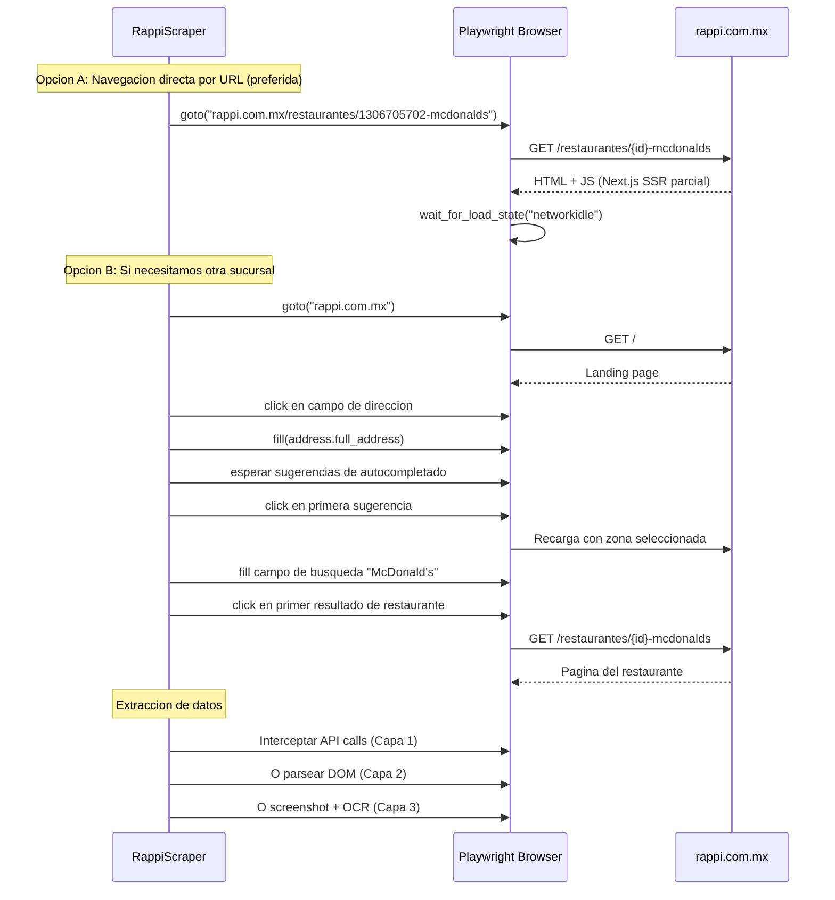
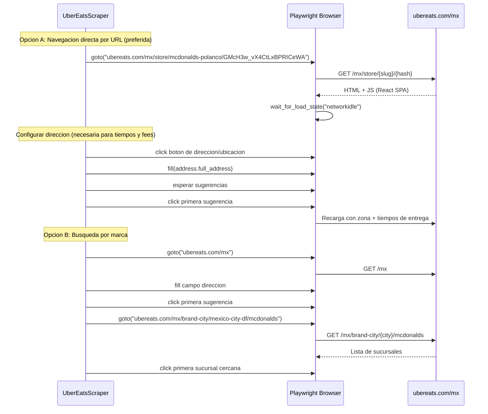
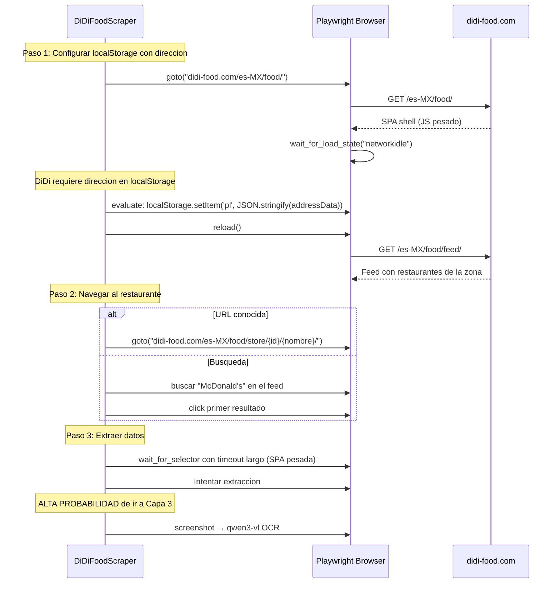

# Navegacion por Plataforma: Flujos y Selectores

## 1. Rappi (rappi.com.mx) — Primera Plataforma

### Flujo de Navegacion Paso a Paso



### Estrategia de Navegacion

```
PREFERIDA: Navegacion directa por URL
  - Rappi tiene URLs predecibles: /restaurantes/{id}-{nombre}
  - IDs numericos descubiertos en spike:
    McDonald's Alvaro Obregon: 1306705702
    McDonald's Centro:         1306705685
    McDonald's Juarez:         1306718166
    McDonald's Supmz 7:        1923200225
  
  - Para MVP 0: hardcodear URLs conocidas
  - Para MVP 1+: descubrir ID por busqueda una vez, cachear

ALTERNATIVA: Busqueda desde home (cuando no conocemos el ID)
  1. Navegar a rappi.com.mx
  2. Ingresar direccion en el campo "Donde quieres recibir tu compra?"
  3. Buscar "McDonald's" en el search
  4. Click en el primer resultado
  5. Extraer datos de la pagina del restaurante
```

### Selectores CSS Iniciales

```python
RAPPI_SELECTORS = {
    # Pagina del restaurante
    "restaurant_name": "[data-testid='store-name'], h1.store-name, .restaurant-header h1",
    "restaurant_rating": "[data-testid='store-rating'], .store-rating, .rating-value",
    "delivery_time": "[data-testid='delivery-time'], .delivery-time, .eta-text",
    "delivery_fee": "[data-testid='delivery-fee'], .delivery-fee, .shipping-cost",
    
    # Productos (lista de items del menu)
    "product_card": "[data-testid='product-card'], .product-card, .menu-item",
    "product_name": "[data-testid='product-name'], .product-name, .item-name",
    "product_price": "[data-testid='product-price'], .product-price, .item-price",
    "product_image": "[data-testid='product-image'], .product-image img",
    
    # Promociones
    "promo_badge": "[data-testid='promo-badge'], .promo-badge, .discount-badge",
    "promo_banner": ".promo-banner, .store-promotion, .campaign-banner",
    
    # Direccion
    "address_input": "[data-testid='address-input'], input[placeholder*='recibir'], input[placeholder*='dirección']",
    "address_suggestion": "[data-testid='address-suggestion'], .address-suggestion, .autocomplete-item",
    
    # Busqueda
    "search_input": "[data-testid='search-input'], input[placeholder*='Buscar'], input[type='search']",
    "search_result": "[data-testid='search-result'], .search-result-item",
}
```

> **NOTA:** Rappi usa Styled Components con hashes (ej: `.sc-dkPtRN`). Los selectores de arriba son estimaciones basadas en patrones comunes de Next.js + testing libraries. **El primer paso del MVP 0 es abrir DevTools y verificar/actualizar estos selectores.**

### API Interception — Endpoints a Buscar

```python
RAPPI_API_PATTERNS = [
    # Next.js data fetching
    r"/_next/data/.+/restaurantes/.+\.json",
    # API interna Rappi
    r"/api/(?:v\d+/)?(?:store|restaurant|menu)",
    r"/graphql",
    # Microservicios
    r"services\.rappi\.com",
    r"microservices\.rappi\.com",
]

# Filtrar responses que contengan datos de productos
def is_useful_response(url: str, status: int, content_type: str) -> bool:
    """Determina si un network response contiene datos utiles."""
    if status != 200:
        return False
    if "json" not in content_type:
        return False
    return any(re.search(pattern, url) for pattern in RAPPI_API_PATTERNS)
```

---

## 2. Uber Eats (ubereats.com/mx) — Segunda Plataforma

### Flujo de Navegacion Paso a Paso



### Estrategia de Navegacion

```
PREFERIDA: Navegacion directa + set address
  - URLs descubiertas en spike:
    McDonald's Polanco: ubereats.com/mx/store/mcdonalds-polanco/GMcH3w_vX4CtLxBPRICeWA
    McDonald's Reforma: ubereats.com/mx/store/mcdonalds-reforma/yD_69FtxTTGWjKm4rJ1BEg
  
  - Problema: hashes son opacos, no podemos generar URLs sin descubrirlas
  - Solucion: usar brand page /brand-city/mexico-city-df/mcdonalds para listar sucursales
  
  - IMPORTANTE: Configurar direccion es necesario para ver tiempos de entrega
    (precios se ven sin direccion, pero tiempos no)

ALTERNATIVA: Brand page → listar sucursales → click la mas cercana
  1. Navegar a ubereats.com/mx
  2. Ingresar direccion (necesario para ver tiempos)
  3. Ir a /brand-city/mexico-city-df/mcdonalds
  4. Seleccionar sucursal mas cercana
  5. Extraer datos

FALLBACK: Si Arkose/botdefense bloquea
  - Capa 3 (screenshot + OCR) directamente
  - Geolocation del browser a las coordenadas de la direccion
```

### Selectores CSS Iniciales

```python
UBER_EATS_SELECTORS = {
    # Pagina de la tienda
    "restaurant_name": "h1[data-testid='store-title'], h1.store-title",
    "restaurant_rating": "[data-testid='store-rating'], .store-rating-text",
    "delivery_time": "[data-testid='store-delivery-time'], .delivery-time",
    "delivery_fee": "[data-testid='store-delivery-fee'], .delivery-fee",
    
    # Productos (menu items)
    "product_card": "[data-testid='store-item'], .menu-item-card",
    "product_name": "[data-testid='rich-text'], .menu-item-name",
    "product_price": "[data-testid='rich-text'] + span, .menu-item-price",
    "product_image": "[data-testid='store-item-image'] img",
    
    # Direccion
    "address_button": "[data-testid='address-selector'], button[aria-label*='address']",
    "address_input": "[data-testid='address-input'], input[placeholder*='address'], input[placeholder*='dirección']",
    "address_suggestion": "[data-testid='address-suggestion'], .address-option",
    
    # Anti-bot challenge
    "arkose_frame": "iframe[src*='arkoselabs'], iframe[src*='funcaptcha']",
    "captcha_container": "[data-testid='captcha-container'], .captcha-wrapper",
    
    # Brand page (lista de sucursales)
    "store_card": "[data-testid='store-card'], .store-card",
    "store_card_name": "[data-testid='store-card'] h3, .store-card-name",
}
```

### API Interception — Endpoints a Buscar

```python
UBER_EATS_API_PATTERNS = [
    # API v1 de tiendas
    r"/api/getStoreV1",
    r"/api/getMenuV1",
    r"/api/getFeedV1",
    # GraphQL
    r"/marketplace/graphql",
    # Eats specific
    r"/eats/v\d+/stores",
    r"/eats/v\d+/menu",
    # Busqueda
    r"/search/v\d+",
]
```

### Manejo de Arkose/Anti-bot

```python
async def handle_arkose_challenge(page) -> bool:
    """Detecta y maneja desafio Arkose/botdefense.
    
    Returns:
        True si paso el challenge, False si hay que ir a Capa 3.
    """
    # Detectar presencia del challenge
    arkose_frame = await page.query_selector("iframe[src*='arkoselabs']")
    if not arkose_frame:
        return True  # No hay challenge
    
    # Estrategia: NO intentar resolver el CAPTCHA programaticamente
    # En su lugar, marcar como bloqueado y escalar a Capa 3
    logger.warning("Arkose challenge detected, falling back to Layer 3 (vision)")
    return False
```

---

## 3. DiDi Food (didi-food.com) — Tercera Plataforma

### Flujo de Navegacion Paso a Paso



### Estrategia de Navegacion

```
REALIDAD: DiDi Food es la plataforma mas dificil.
  - SPA vanilla (no React/Next.js) = sin server-side rendering
  - Requiere JavaScript completo + posiblemente login
  - localStorage key 'pl' guarda la direccion
  - Spike no pudo verificar precios con fetch estatico

ESTRATEGIA PRAGMATICA:
  1. Intentar API interception (Capa 1): 
     SPA pura = TODO pasa por APIs, interceptar es la mejor opcion
  2. Si falla, intentar DOM con localStorage hackeado (Capa 2):
     Inyectar direccion en localStorage, recargar, esperar SPA
  3. Si falla, screenshot + OCR (Capa 3):
     Alta probabilidad de terminar aqui para DiDi
  4. Si todo falla, documentar como "plataforma parcial"
     y enfocarse en Rappi + Uber Eats (brief dice "priorizar calidad")

DECISION DE CORTE:
  Si despues de 2 horas DiDi no produce datos → pivot a solo 2 plataformas
  Mejor 2 plataformas bien scrapeadas que 3 a medias
```

### Selectores CSS Iniciales (Estimados)

```python
DIDI_FOOD_SELECTORS = {
    # Muy probablemente van a cambiar - DiDi usa SPA vanilla
    "restaurant_name": ".store-name, .shop-name, h1",
    "restaurant_rating": ".store-rating, .shop-rating",
    "delivery_time": ".delivery-time, .eta",
    "delivery_fee": ".delivery-fee, .shipping-fee",
    
    # Productos
    "product_card": ".food-item, .menu-item, .product-card",
    "product_name": ".food-name, .item-name, .product-name",
    "product_price": ".food-price, .item-price, .product-price",
    
    # Feed / Home
    "store_card": ".store-card, .shop-card",
    "search_input": "input[type='search'], .search-input",
    
    # Login wall (puede aparecer)
    "login_modal": ".login-modal, .login-wrapper, [class*='login']",
    "login_close": ".login-close, .modal-close, button[class*='close']",
}
```

> **NOTA:** Selectores de DiDi son los menos confiables. Esperamos actualizar esto durante el MVP 0 spike con browser real.

### API Interception — Endpoints a Buscar

```python
DIDI_FOOD_API_PATTERNS = [
    # API Gateway
    r"food\.didi-food\.com/api/",
    r"food-api\.didi-food\.com/",
    # Store/Menu endpoints
    r"/store/detail",
    r"/menu/list",
    r"/search/",
    # Developer API (descubierta en spike)
    r"developer\.didi-food\.com/",
]
```

### Manejo de localStorage para Direccion

```python
async def set_didi_address(page, address: Address) -> None:
    """Inyecta direccion en localStorage de DiDi Food.
    
    DiDi usa la key 'pl' en localStorage para la ubicacion del usuario.
    Sin esta key, el feed no muestra restaurantes.
    """
    address_data = {
        "lat": address.lat,
        "lng": address.lng,
        "address": address.full_address or address.label,
        "city": address.city,
    }
    await page.evaluate(f"""
        localStorage.setItem('pl', JSON.stringify({json.dumps(address_data)}));
    """)
    await page.reload()
    await page.wait_for_load_state("networkidle")
```

---

## 4. Navegacion Retail/Convenience por Plataforma (ADR-004)

El sistema busca productos en 2-3 tipos de tienda por direccion. El flujo de navegacion cambia segun el tipo.

### Rappi — Retail

```
TIENDA DE CONVENIENCIA (Oxxo):
  Opcion A: URL directa si conocemos el ID
    → rappi.com.mx/tiendas/{id}-oxxo
  
  Opcion B: Buscar "Oxxo" desde home con direccion configurada
    → rappi.com.mx → buscar "Oxxo" → click primera tienda
  
  Opcion C: Rappi Turbo (tienda propia de Rappi)
    → rappi.com.mx/turbo → productos de conveniencia directos
    → Coca-Cola y Agua probablemente estan aqui
    → Ventaja: no necesita Oxxo, es servicio propio de Rappi

FARMACIA (Panales):
  Opcion A: Rappi Farmacia
    → rappi.com.mx/farmacia → buscar "panales" o "huggies"
  
  Opcion B: Buscar "panales" en busqueda general
    → Rappi muestra resultados de multiples tiendas
```

### Uber Eats — Retail

```
TIENDA DE CONVENIENCIA (Oxxo):
  Opcion A: Brand page
    → ubereats.com/mx/brand-city/mexico-city-df/oxxo
    → Lista sucursales de Oxxo cercanas
  
  Opcion B: Buscar "Oxxo" con direccion configurada
    → ubereats.com/mx → search "Oxxo" → primera tienda

FARMACIA (Panales):
  Opcion A: Buscar "Farmacias del Ahorro" o "Farmacia Guadalajara"
  Opcion B: Buscar "panales huggies" en search general
```

### DiDi Food — Retail

```
TIENDA DE CONVENIENCIA:
  Misma estrategia que restaurantes: feed + busqueda con localStorage
  Buscar "Oxxo" o "tienda" en el feed

FARMACIA:
  Por verificar. Probable que DiDi tenga seccion de farmacia menor.
  Si no existe → documentar como limitacion de DiDi.
```

### Selectores CSS Retail (Estimados)

```python
# Los selectores de tiendas de conveniencia/farmacia son DIFERENTES
# a los de restaurantes. La estructura de menu cambia:
# - Restaurante: categorias de comida → platos
# - Tienda: pasillos/categorias → productos con marca/tamaño

RETAIL_SELECTORS_COMMON = {
    "product_card": ".product-card, .item-card, [data-testid='product']",
    "product_name": ".product-name, .item-name, [data-testid='product-name']",
    "product_price": ".product-price, .item-price, [data-testid='product-price']",
    "product_size": ".product-size, .item-size, .product-description",
    "search_input": "input[type='search'], input[placeholder*='Buscar']",
}
```

### Flujo Multi-Store por Direccion

```
Para cada direccion:
  1. RESTAURANTE: McDonald's
     → search_store(RESTAURANT, "McDonald's")
     → extract_items(["Big Mac", "McNuggets", "Combo Mediano"])
     → ~20s con delays
  
  2. CONVENIENCIA: Oxxo / Rappi Turbo
     → search_store(CONVENIENCE, "Oxxo")
     → extract_items(["Coca-Cola 600ml", "Agua Bonafont 1L"])
     → ~15s con delays
  
  3. FARMACIA: Farmacia del Ahorro / Rappi Farmacia (MVP 2+)
     → search_store(PHARMACY, null)  ← primera disponible
     → extract_items(["Panales"])
     → ~15s con delays
  
  Total por direccion: ~50s (vs ~20s solo McDonald's)
  Total 25 dirs × 3 plat: ~60-75 min (vs ~30 min solo restaurante)
```

---

## 5. Resumen Comparativo

| Aspecto | Rappi | Uber Eats | DiDi Food |
|---------|-------|-----------|-----------|
| **Navegacion** | URL directa con ID numerico | URL directa con hash O brand page | URL directa O feed con localStorage |
| **Direccion necesaria para** | Buscar por zona (precios sin ella) | Ver tiempos de entrega | Ver cualquier cosa (feed) |
| **Como ingresar direccion** | Input text + autocompletado | Input text + autocompletado | localStorage injection |
| **Anti-bot** | reCAPTCHA (medio) | Arkose + botdefense (alto) | Desconocido |
| **Capa probable** | Capa 1 (API) o Capa 2 (DOM) | Capa 1 (API) o Capa 3 (vision si Arkose) | Capa 1 (API) o Capa 3 (vision) |
| **Confianza en selectores** | MEDIA (Styled Components) | MEDIA (React + data-testid posible) | BAJA (SPA vanilla) |
| **Descubrimiento pendiente** | Verificar selectores con DevTools | Verificar selectores + Arkose behavior | Verificar TODO con browser real |

### Orden de Descubrimiento en MVP 0

```
DIA 1 - PRIMERA HORA:
  1. Abrir Rappi con Playwright headless → DevTools → verificar selectores
  2. Interceptar network → buscar APIs utiles
  3. Ajustar RAPPI_SELECTORS con los selectores reales
  4. Extraer 1 dato real de McDonald's con Capa 1 o 2

DIA 1 - SEGUNDA HORA:
  5. Repetir con Uber Eats → verificar si Arkose bloquea
  6. Si Arkose bloquea → ir directo a Capa 3 (screenshot)
  7. Si no bloquea → interceptar API, verificar selectores

DIA 1 - TERCERA HORA (si hay tiempo):
  8. Intentar DiDi Food con localStorage hack
  9. Si funciona → genial, verificar selectores
  10. Si no → documentar, planear Capa 3 o pivotar a 2 plataformas
```
