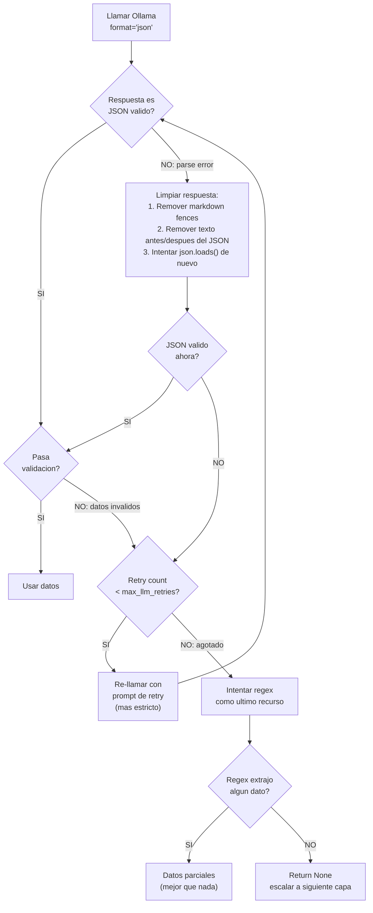

# Prompt Templates para Ollama

## 1. qwen3-vl:8b — OCR de Screenshots (Capa 3)

### Prompt: Extraccion completa de datos de restaurante

```python
VISION_EXTRACTION_SYSTEM = """Eres un extractor de datos de capturas de pantalla de aplicaciones de delivery de comida en Mexico.
Tu trabajo es leer la imagen y extraer datos estructurados en JSON.
Responde UNICAMENTE con JSON valido, sin explicaciones ni texto adicional.
Todos los precios estan en MXN (pesos mexicanos)."""

VISION_EXTRACTION_USER = """Analiza esta captura de pantalla de {platform_name} y extrae los siguientes datos en formato JSON:

{{
  "restaurant_name": "nombre del restaurante",
  "products": [
    {{
      "name": "nombre del producto tal como aparece",
      "price": 0.00
    }}
  ],
  "delivery_fee": null,
  "delivery_fee_text": "texto original del fee",
  "delivery_time": null,
  "delivery_time_text": "texto original del tiempo",
  "rating": null,
  "promotions": []
}}

Reglas:
- Si un campo no es visible en la imagen, usa null
- delivery_fee y delivery_time son numeros (float y int respectivamente)
- price siempre es float (ej: 145.00, no "$145")
- promotions es una lista de strings con el texto exacto de cada promocion visible
- Si ves varios productos, incluye todos los que puedas leer
- Busca especificamente estos productos si estan visibles: {product_names}"""
```

### Prompt: Extraccion enfocada a un producto especifico

```python
VISION_PRODUCT_FOCUS_USER = """En esta captura de {platform_name}, busca el producto "{product_name}" y extrae:

{{
  "found": true,
  "name": "nombre exacto como aparece en pantalla",
  "price": 0.00,
  "available": true
}}

Si el producto no esta visible en la imagen, responde:
{{"found": false, "name": null, "price": null, "available": false}}

Responde SOLO con JSON valido."""
```

### Validacion de Respuesta

```python
def validate_vision_response(response: dict) -> bool:
    """Valida que la respuesta del modelo de vision sea usable."""
    # Debe tener al menos restaurant_name o products
    if not response.get("restaurant_name") and not response.get("products"):
        return False
    
    # Si hay productos, al menos 1 debe tener precio
    products = response.get("products", [])
    if products:
        has_price = any(p.get("price") is not None for p in products)
        if not has_price:
            return False
    
    # Precios deben estar en rango razonable (MXN)
    for p in products:
        price = p.get("price")
        if price is not None and (price < 1 or price > 1000):
            return False
    
    return True
```

---

## 2. qwen3.5:4b — Parseo de Texto Roto (Capa 2 Fallback)

### Prompt: Extraccion de datos de texto desestructurado

```python
TEXT_PARSER_SYSTEM = """Eres un parser de datos de texto crudo extraido de paginas web de delivery de comida en Mexico.
Recibes texto sin formato (copiado de una pagina web) y debes extraer datos estructurados.
Responde UNICAMENTE con JSON valido. Todos los precios en MXN."""

TEXT_PARSER_USER = """Extrae datos estructurados del siguiente texto crudo de {platform_name}.
El texto fue copiado de la pagina de un restaurante de comida:

---
{raw_text}
---

Responde con este formato JSON:
{{
  "restaurant_name": "nombre si lo encuentras",
  "products": [
    {{
      "name": "nombre del producto",
      "price": 0.00
    }}
  ],
  "delivery_fee": null,
  "delivery_time_min": null,
  "delivery_time_max": null,
  "rating": null,
  "promotions": []
}}

Reglas:
- Busca patrones de precio como "$XX.XX", "MXN XX", numeros cerca de nombres de comida
- delivery_fee: busca "envio", "delivery", "costo de envio"
- delivery_time: busca "min", "minutos", numeros con formato "XX-XX min"
- rating: busca numeros con formato "X.X" cerca de estrellas o "calificacion"
- Si no encuentras un campo, usa null
- Busca especificamente: {product_names}"""
```

### Prompt: Re-intento cuando JSON es invalido

```python
TEXT_PARSER_RETRY_USER = """Tu respuesta anterior no fue JSON valido. 
Intenta de nuevo con el mismo texto.

IMPORTANTE: Responde SOLO con JSON. Sin explicaciones. Sin markdown.
No uses ```json```. Solo el objeto JSON directamente.

Texto original:
---
{raw_text}
---

Formato esperado:
{{"restaurant_name": "...", "products": [...], "delivery_fee": null, ...}}"""
```

---

## 3. qwen3.5:9b — Generacion de Insights

### Prompt: 5 Insights Accionables

```python
INSIGHTS_SYSTEM = """Eres un analista senior de competitive intelligence para Rappi Mexico.
Tu trabajo es analizar datos de precios de delivery y generar insights accionables para el equipo de estrategia.
Responde en espanol. Se especifico con numeros y porcentajes reales del dataset.
NO inventes datos. Solo usa los numeros que aparecen en el dataset proporcionado."""

INSIGHTS_USER = """Analiza estos datos comparativos de precios de delivery en Ciudad de Mexico.
Los datos comparan {n_platforms} plataformas en {n_addresses} direcciones con {n_products} productos.

RESUMEN ESTADISTICO:
{stats_summary}

PRECIO PROMEDIO POR PLATAFORMA:
{platform_avg_prices}

TOP 10 DIFERENCIAS DE PRECIO (mayor a menor):
{top_price_deltas}

ANALISIS POR ZONA GEOGRAFICA:
{zone_analysis}

DELIVERY FEES PROMEDIO:
{fee_summary}

TIEMPOS DE ENTREGA PROMEDIO:
{time_summary}

PROMOCIONES DETECTADAS:
{promotions_summary}

COMPARATIVA RETAIL VS FAST FOOD (markup por categoria):
{category_comparison}

---

Genera exactamente 5 insights accionables. Cada insight debe cubrir UNA de estas 5 dimensiones
(el brief las pide explicitamente):

  1. POSICIONAMIENTO DE PRECIOS — Como se comparan los precios de Rappi vs competencia
  2. VENTAJA OPERACIONAL — Tiempos de entrega, cobertura, disponibilidad por zona
  3. ESTRUCTURA DE FEES — Delivery fees, como afectan el precio final percibido
  4. ESTRATEGIA PROMOCIONAL — Que promociones corre la competencia, frecuencia, agresividad
  5. VARIABILIDAD GEOGRAFICA — Como cambian precios/fees/tiempos entre zonas de CDMX

Para cada uno usa este formato EXACTO:

### Insight #1: [Titulo corto y accionable, max 10 palabras]
**Dimension:** [Posicionamiento de Precios | Ventaja Operacional | Estructura de Fees | Estrategia Promocional | Variabilidad Geografica]
**Finding:** [Dato especifico con numeros del dataset. Ej: "Rappi cobra $155 por Big Mac vs $145 en Uber Eats, un 6.9% mas caro"]
**Impacto:** [Por que importa para Rappi. Cuantifica si es posible. Ej: "Con 50K pedidos/dia de Big Mac en CDMX, el sobreprecio podria costar X usuarios"]
**Recomendacion:** [Accion concreta que un VP de Pricing podria tomar manana. Ej: "Negociar con McDonald's MX un precio base competitivo para zonas premium"]

### Insight #2: ...
(continuar hasta Insight #5, UNA dimension diferente por insight)

CRITERIOS PARA BUENOS INSIGHTS:
- OBLIGATORIO: Exactamente 1 insight por cada una de las 5 dimensiones
- Prioriza findings con diferencias >5% (estadisticamente relevantes)
- Si hay datos de retail (Coca-Cola, Agua), usarlos para comparar markup entre categorias
- Cada recomendacion debe ser ejecutable, no generica
- Usa datos REALES del dataset, no inventes numeros"""
```

### Prompt: Resumen Ejecutivo (1 parrafo)

```python
EXECUTIVE_SUMMARY_USER = """Basado en estos insights ya generados, escribe UN parrafo de resumen ejecutivo (max 100 palabras) 
para un VP de Strategy de Rappi que no tiene tiempo de leer el reporte completo.

Insights:
{insights_text}

El parrafo debe empezar con el hallazgo mas impactante y terminar con la recomendacion mas urgente.
Escribe en espanol profesional, sin bullet points, solo texto corrido."""
```

---

## 4. nomic-embed-text — Product Matching

No usa prompts (es modelo de embeddings), pero documenta la interfaz:

```python
# Input: string de texto
# Output: vector de 768 dimensiones

# Uso en ProductMatcher:
embedding = ollama.embed(model="nomic-embed-text", input="Big Mac Tocino")
# Returns: {"embeddings": [[0.012, -0.034, 0.056, ...]]}

# Cosine similarity para matching:
# > 0.95: match exacto (mismo producto, variacion ortografica)
# 0.85-0.95: match probable (mismo producto, nombre diferente)
# 0.70-0.85: match posible (producto similar, verificar manualmente)
# < 0.70: no match

# Ejemplos de similarity esperada (basados en tests con nomic):
# "Big Mac" vs "BigMac"                  → ~0.97 (variacion ortografica)
# "Big Mac" vs "Big Mac Tocino"          → ~0.88 (mismo base, variante)
# "Big Mac" vs "Big Mac Individual"      → ~0.90 (mismo base, variante)
# "Big Mac" vs "Hamburguesa Big Mac"     → ~0.86 (prefijo diferente)
# "Big Mac" vs "McPollo"                 → ~0.65 (diferente producto)
# "Big Mac" vs "Coca-Cola 600ml"         → ~0.30 (categoria diferente)
```

---

## 5. Estrategia de Manejo de Errores LLM

### Cuando el LLM devuelve JSON invalido



### Limpieza de Respuesta

```python
import json
import re

def clean_llm_response(raw: str) -> dict | None:
    """Intenta extraer JSON valido de una respuesta LLM ruidosa."""
    # Paso 1: intentar directo
    try:
        return json.loads(raw)
    except json.JSONDecodeError:
        pass
    
    # Paso 2: remover markdown fences
    cleaned = re.sub(r'```(?:json)?\s*', '', raw)
    cleaned = cleaned.strip()
    try:
        return json.loads(cleaned)
    except json.JSONDecodeError:
        pass
    
    # Paso 3: buscar primer { y ultimo }
    start = cleaned.find('{')
    end = cleaned.rfind('}')
    if start != -1 and end != -1 and end > start:
        try:
            return json.loads(cleaned[start:end + 1])
        except json.JSONDecodeError:
            pass
    
    return None
```

### Regex Fallback (ultimo recurso)

```python
def regex_extract_prices(text: str) -> list[dict]:
    """Extrae precios con regex cuando el LLM falla completamente."""
    items = []
    # Patron: "nombre" seguido de "$XX.XX"
    pattern = r'["\']?([^"\'$\n]{3,40})["\']?\s*[\$:]\s*(\d+\.?\d{0,2})'
    for match in re.finditer(pattern, text):
        name = match.group(1).strip()
        price = float(match.group(2))
        if 1 < price < 1000:  # rango razonable MXN
            items.append({"name": name, "price": price})
    return items
```

---

## 6. Prompts — Resumen Rapido

| Modelo | Cuando | System prompt | Formato salida | Max retries |
|--------|--------|---------------|----------------|-------------|
| `qwen3-vl:8b` | Capa 3: screenshot → datos | `VISION_EXTRACTION_SYSTEM` | JSON con products, fees, time | 2 |
| `qwen3.5:4b` | Capa 2 fallback: texto roto | `TEXT_PARSER_SYSTEM` | JSON con products, fees, time | 2 |
| `qwen3.5:9b` | Post-scraping: generar insights | `INSIGHTS_SYSTEM` | Markdown con 5 insights | 1 |
| `nomic-embed-text` | Normalizacion: matching productos | N/A (embeddings) | Vector 768d | 0 |
