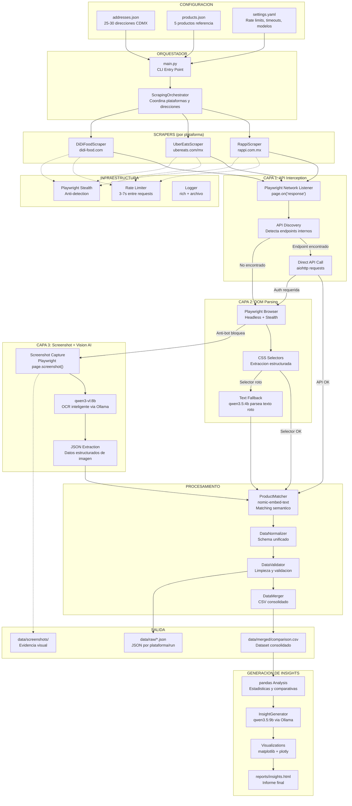
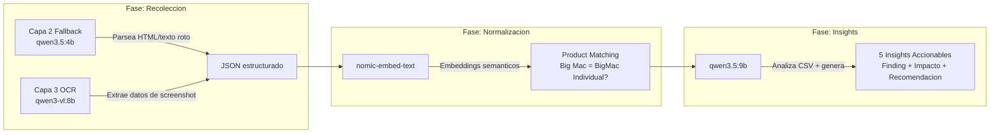

# Sistema General - Arquitectura de 3 Capas

## Diagrama General del Sistema



---

## Descripcion de las 3 Capas de Recoleccion

### Capa 1: API Interception (la mas rapida y estable)

```
Flujo: Playwright navega → intercepta network requests → descubre endpoints API internos
       → llama directo con aiohttp → JSON limpio, rapido, estable

Probabilidad de exito: ~60%
Ideal para: Rappi (Next.js con /_next/data/), Uber Eats (React SPA con APIs internas)
Ventaja: Datos estructurados, rapido, menos detectable
Riesgo: Endpoints pueden requerir auth tokens complejos
```

### Capa 2: Browser Automation + DOM Parsing (la clasica)

```
Flujo: Playwright/Stealth navega como usuario real → espera carga JS
       → extrae con selectores CSS → si falla, qwen3.5:4b parsea texto crudo → JSON

Probabilidad de exito: ~70%
Ideal para: Todas las plataformas como segunda opcion
Ventaja: Simula usuario real, accede a todo lo visible
Riesgo: Anti-bot (Arkose en Uber, reCAPTCHA en Rappi), selectores CSS dinamicos
```

### Capa 3: Screenshot + Vision AI (el Plan B inteligente)

```
Flujo: Playwright captura screenshot de la pagina → qwen3-vl:8b (Ollama local)
       → OCR inteligente → extrae datos como JSON

Probabilidad de exito: ~95%
Ideal para: DiDi Food (SPA pesada), cualquier plataforma cuando Capas 1 y 2 fallan
Ventaja: Siempre funciona si la pagina renderiza, screenshots quedan como EVIDENCIA
Riesgo: Mas lento (~3-5s por imagen), posible perdida de precision en decimales
```

---

## Integracion de Modelos Ollama en el Flujo



| Modelo | Fase | Funcion | RAM | Prioridad |
|--------|------|---------|-----|-----------|
| `qwen3-vl:8b` | Recoleccion (Capa 3) | OCR de screenshots | ~6GB | ALTA |
| `qwen3.5:4b` | Recoleccion (Capa 2 fallback) | Parseo de texto desestructurado | ~3GB | MEDIA |
| `nomic-embed-text` | Normalizacion | Matching semantico de productos | ~0.5GB | MEDIA |
| `qwen3.5:9b` | Insights | Generacion de insights accionables | ~6GB | ALTA |

---

## Componentes y Responsabilidades

| Componente | Ubicacion | Responsabilidad |
|------------|-----------|-----------------|
| **main.py** | `desarrollo/src/main.py` | CLI entry point, parsea argumentos, inicia orquestador |
| **ScrapingOrchestrator** | `desarrollo/src/scrapers/orchestrator.py` | Coordina ejecucion: plataformas × direcciones, maneja fallback entre capas |
| **BaseScraper** | `desarrollo/src/scrapers/base.py` | Clase abstracta con logica comun de las 3 capas |
| **RappiScraper** | `desarrollo/src/scrapers/rappi.py` | Scraper especifico para rappi.com.mx |
| **UberEatsScraper** | `desarrollo/src/scrapers/uber_eats.py` | Scraper especifico para ubereats.com/mx |
| **DiDiFoodScraper** | `desarrollo/src/scrapers/didi_food.py` | Scraper especifico para didi-food.com |
| **VisionFallback** | `desarrollo/src/scrapers/vision_fallback.py` | Capa 3: screenshot + qwen3-vl OCR |
| **TextParser** | `desarrollo/src/scrapers/text_parser.py` | Capa 2 fallback: qwen3.5:4b parsea texto roto |
| **ProductMatcher** | `desarrollo/src/processors/product_matcher.py` | Matching semantico con nomic-embed-text |
| **DataNormalizer** | `desarrollo/src/processors/normalizer.py` | Unifica schemas entre plataformas |
| **DataValidator** | `desarrollo/src/processors/validator.py` | Valida rangos, tipos, completitud |
| **DataMerger** | `desarrollo/src/processors/merger.py` | Genera CSV consolidado |
| **InsightGenerator** | `desarrollo/src/analysis/insights.py` | Genera insights con qwen3.5:9b |
| **Visualizations** | `desarrollo/src/analysis/visualizations.py` | Graficos con matplotlib/plotly |
| **ReportGenerator** | `desarrollo/src/analysis/report_generator.py` | Genera HTML/Jupyter final |
| **Config** | `desarrollo/src/config.py` | Carga y valida configuracion |
| **RateLimiter** | `desarrollo/src/utils/rate_limiter.py` | Control de velocidad entre requests |
| **Logger** | `desarrollo/src/utils/logger.py` | Logging con rich (consola) + archivo |
| **Screenshot** | `desarrollo/src/utils/screenshot.py` | Captura y almacena screenshots |

---

## Flujo End-to-End

```
1. ENTRADA
   Usuario ejecuta: python -m src.main --platforms rappi,uber_eats,didi_food
   Config loader lee: addresses.json, products.json, settings.yaml

2. ORQUESTACION
   ScrapingOrchestrator recibe config
   Para cada plataforma (Rappi → Uber → DiDi):
     Para cada direccion (25-30 en CDMX):
       Intenta Capa 1 → si falla → Capa 2 → si falla → Capa 3
       Guarda ScrapedResult + screenshot opcional
       Rate limit: 3-7s random delay

3. NORMALIZACION
   ProductMatcher usa nomic-embed-text para alinear nombres
   DataNormalizer unifica schema (precios en MXN, tiempos en minutos)
   DataValidator limpia outliers y valida completitud
   DataMerger genera comparison.csv

4. INSIGHTS
   pandas calcula estadisticas (promedios, deltas, variabilidad)
   qwen3.5:9b genera 5 insights: Finding + Impacto + Recomendacion
   matplotlib/plotly genera 3+ visualizaciones
   ReportGenerator empaqueta en HTML

5. SALIDA
   data/raw/          → JSON por plataforma y run
   data/merged/       → comparison.csv consolidado
   data/screenshots/  → Evidencia visual
   reports/           → insights.html + charts/
```
