# Tolerancia a Fallos: Como se Comporta el Sistema

## Principio: El Sistema Siempre Produce Datos

```
NO hay escenario donde el sistema termine con 0 datos.
Cada nivel de fallo tiene un mecanismo de recuperacion.
Si TODO falla, hay datos pre-scrapeados como backup.
```

---

## Mapa Completo de Fallos

```mermaid
graph TB
    subgraph "NIVEL 1: Fallo de una Capa"
        A1["Capa 1 falla<br/>(API no encontrada)"] --> A2["Escala a Capa 2<br/>(DOM parsing)"]
        A2 --> A3["Capa 2 falla<br/>(selectores rotos)"]
        A3 --> A4["Fallback qwen3.5:4b<br/>(parsea texto crudo)"]
        A4 --> A5["LLM falla<br/>(JSON invalido)"]
        A5 --> A6["Escala a Capa 3<br/>(Screenshot + OCR)"]
    end

    subgraph "NIVEL 2: Fallo de una Direccion"
        B1["3 capas fallan<br/>para 1 direccion"] --> B2["Retry completo<br/>(max 2 intentos)"]
        B2 --> B3["Aun falla"] --> B4["ScrapedResult<br/>success=False<br/>Continuar siguiente dir"]
    end

    subgraph "NIVEL 3: Fallo de una Plataforma"
        C1["≥60% fallos en<br/>ultimas 10 dirs"] --> C2["Circuit breaker<br/>PAUSAR plataforma"]
        C2 --> C3["Continuar con<br/>otras plataformas"]
    end

    subgraph "NIVEL 4: Fallo de Ollama"
        D1["Ollama no esta<br/>corriendo"] --> D2["Warning al inicio<br/>NO es fatal"]
        D2 --> D3["Capas 1 y 2<br/>funcionan sin Ollama"]
        D3 --> D4["Capa 3 y matching<br/>deshabilitados"]
        D4 --> D5["Sistema funciona<br/>con capacidad reducida"]
    end

    subgraph "NIVEL 5: Fallo Total de Scraping"
        E1["0 datos de<br/>todas las plataformas"] --> E2["--use-backup<br/>datos pre-scrapeados"]
        E2 --> E3["Normalizacion + Insights<br/>funcionan normal"]
    end

    subgraph "NIVEL 6: Fallo del LLM de Insights"
        F1["qwen3.5:9b genera<br/>insights genericos"] --> F2["Editar manualmente<br/>(son 5 parrafos)"]
        F1 --> F3["qwen3.5:9b no<br/>esta disponible"] --> F4["pandas genera<br/>estadisticas + charts<br/>Insights = seccion vacia"]
    end

    style A6 fill:#FF9800,color:#fff
    style B4 fill:#FF9800,color:#fff
    style C3 fill:#FF9800,color:#fff
    style D5 fill:#FF9800,color:#fff
    style E3 fill:#4CAF50,color:#fff
    style F2 fill:#4CAF50,color:#fff
```



---

## Detalle por Nivel

### NIVEL 1: Fallo de una Capa de Recoleccion

| Fallo | Causa | Recuperacion | Referencia |
|-------|-------|-------------|------------|
| Capa 1 (API) no encuentra endpoint | Plataforma no expone APIs utiles o requieren auth | Escalar a Capa 2 (DOM) | flujo-datos.md sec 2 |
| Capa 1 retorna HTTP 403 | API protegida | Escalar a Capa 2 | flujo-datos.md sec 5 |
| Capa 1 retorna HTTP 429 | Rate limited | Esperar 30s, retry 1 vez, luego Capa 2 | flujo-datos.md sec 5 |
| Capa 2 timeout (selector no encontrado) | DOM cambio o JS no cargo | Retry con +5s timeout, luego fallback LLM | flujo-datos.md sec 5 |
| Capa 2 selectores rotos | Styled Components cambio hashes | qwen3.5:4b parsea texto crudo de la pagina | prompts-ollama.md sec 2 |
| Capa 2 LLM retorna JSON invalido | Modelo no entendio el prompt | Limpiar JSON → retry con prompt estricto → regex | prompts-ollama.md sec 5 |
| Capa 2 anti-bot (Arkose/reCAPTCHA) | Deteccion de bot | Escalar a Capa 3 (no intentar resolver CAPTCHA) | navegacion-plataformas.md |
| Capa 3 screenshot negro/vacio | Pagina no renderizo | Retry con 2s delay | flujo-datos.md sec 5 |
| Capa 3 OCR no extrae datos | Imagen borrosa o layout inesperado | ScrapedResult(success=False), loguear | flujo-datos.md sec 5 |

**Resultado:** Si al menos 1 capa funciona → datos obtenidos. Las 3 capas fallan → Nivel 2.

### NIVEL 2: Fallo de una Direccion Completa

```
Intento 1: Capa 1 → Capa 2 → Capa 2 LLM → Capa 3 → FALLO
  ↓ esperar 5s, nuevo browser context
Intento 2: Capa 1 → Capa 2 → Capa 2 LLM → Capa 3 → FALLO
  ↓ esperar 5s, nuevo browser context  
Intento 3: Capa 1 → Capa 2 → Capa 2 LLM → Capa 3 → FALLO
  ↓
ScrapedResult(success=False, error_message="all layers failed after 2 retries")
→ Se guarda en raw JSON (para diagnostico)
→ NO se incluye en comparison.csv
→ Continuar con siguiente direccion
```

**Resultado:** Datos parciales (N-1 direcciones). No se detiene el run.

### NIVEL 3: Fallo Masivo en una Plataforma

```
Circuit breaker: ventana de 10 direcciones
  Dir 1:  FAIL
  Dir 2:  OK
  Dir 3:  FAIL
  Dir 4:  FAIL
  Dir 5:  FAIL
  Dir 6:  FAIL
  Dir 7:  FAIL
  Dir 8:  OK
  Dir 9:  FAIL
  Dir 10: FAIL
  → 8/10 = 80% fallos ≥ 60% umbral
  → PAUSAR esta plataforma
  → Log: "[rappi] CIRCUIT BREAKER: 8/10 failed, pausing"
  → Continuar con uber_eats, didi_food
```

**Resultado:** 2 de 3 plataformas tienen datos. Brief dice "priorizar calidad". 2 plataformas bien > 3 a medias.

### NIVEL 4: Ollama No Disponible

```
Al iniciar el sistema:
  1. OllamaClient.is_available() → False
  2. Log WARNING: "Ollama not available. Layers 2-fallback and 3 disabled."
  3. El sistema NO se detiene

Impacto:
  ✅ Capa 1 (API interception): funciona normal (no usa Ollama)
  ✅ Capa 2 (DOM parsing): funciona normal (no usa Ollama)
  ❌ Capa 2 fallback (text parser): deshabilitado (necesita qwen3.5:4b)
  ❌ Capa 3 (vision OCR): deshabilitado (necesita qwen3-vl:8b)
  ❌ Product matching (embeddings): fallback a solo aliases (sin nomic-embed-text)
  ❌ Insight generation: deshabilitado (necesita qwen3.5:9b)
  ✅ Charts/visualizaciones: funcionan (matplotlib, no necesitan Ollama)

Resultado: Sistema con capacidad reducida pero funcional.
           Datos de Capas 1-2, sin OCR ni insights LLM.
           Charts se generan, insights quedan como seccion vacia en HTML.
```

### NIVEL 5: Scraping Falla Completamente

```
Escenario: las 3 plataformas bloquearon scraping
  → 0 datos nuevos
  → Circuit breaker pausó las 3

Recuperacion:
  python -m src.main --use-backup
  → Carga datos pre-scrapeados de data/backup/
  → Normalizacion e insights se ejecutan normalmente
  → Reporte se genera con datos reales (solo no son de hoy)
```

**Resultado:** Reporte con datos reales pre-scrapeados. Para la presentacion es transparente: "Los datos son de [fecha], el scraping en vivo fue bloqueado por anti-bot."

### NIVEL 6: Fallo en Generacion de Insights

| Fallo | Recuperacion |
|-------|-------------|
| qwen3.5:9b genera insights genericos | Editar manualmente los 5 parrafos |
| qwen3.5:9b no parsea bien el formato | Retry con prompt mas estricto |
| qwen3.5:9b no esta disponible | pandas genera estadisticas, charts se generan, insights = seccion vacia en HTML |
| Chart falla por datos insuficientes | Adaptar a 2 plataformas o eliminar chart |
| HTML no genera | Notebook analysis.ipynb como alternativa |

---

## Resumen: Degradacion Elegante

```
ESTADO IDEAL:
  3 plataformas × 25 dirs × 6 productos = ~450 data points
  5 insights + 4 charts + reporte HTML
  
DEGRADACION 1 (una plataforma falla):
  2 plataformas × 25 dirs = ~300 data points
  Insights se adaptan a 2 plataformas
  Brief dice "priorizar calidad" → 2 bien > 3 mal

DEGRADACION 2 (Ollama no disponible):
  3 plataformas pero solo Capas 1-2
  Sin OCR, sin insight LLM, sin product matching por embedding
  Charts y estadisticas funcionan
  
DEGRADACION 3 (scraping bloqueado):
  Datos pre-scrapeados (--use-backup)
  Pipeline de insights funciona normal
  Datos reales, solo no son de hoy

DEGRADACION 4 (todo falla):
  Abrir reports/insights.html pre-generado
  Presentar con datos anteriores
  "El sistema es resiliente, estos datos se generaron el [fecha]"

EN NINGUN CASO hay 0 output.
```

---

## Relacion con ADRs

| ADR | Fallo que resuelve |
|-----|-------------------|
| ADR-002 (3 capas) | Si una tecnica de scraping falla, hay 2 mas |
| ADR-003 (service fee) | No intentamos lo imposible, documentamos |
| ADR-004 (retail) | Si farmacia falla → seguir con restaurant + convenience |
| ADR-001 (Rappi primero) | Empezar por lo mas facil = datos garantizados rapido |

---

## Que Decir en la Presentacion sobre Fallos

```
PREGUNTA: "Que pasa si te bloquean durante la demo?"
RESPUESTA: 
  "El sistema tiene 3 capas de recoleccion. Si la primera falla, 
   escala automaticamente a la segunda. Si las 3 fallan para una 
   direccion, el circuit breaker pausa esa plataforma y continua 
   con las demas. Y si todo falla, tengo datos pre-scrapeados 
   reales de [fecha]. En ningun escenario me quedo sin datos."

PREGUNTA: "Y si Ollama no esta disponible?"
RESPUESTA:
  "Las capas 1 y 2 funcionan sin Ollama. Solo la vision AI y los 
   insights automaticos se deshabilitan. Los charts y estadisticas 
   se generan con pandas y matplotlib directamente."
```
