# Guia de Ejecucion: MVPs Paso a Paso

> Este documento es el **playbook** para ejecutar cada MVP.
> Cada MVP sigue el mismo ciclo: codigo → tests → pruebas/ → commit → merge → tag → release.

---

## Ciclo de Cada MVP

```
1. CREAR BRANCH
   git checkout develop
   git checkout -b feature/xxx

2. IMPLEMENTAR
   Escribir codigo en desarrollo/src/

3. TESTS AUTOMATIZADOS
   Escribir tests en desarrollo/tests/
   Ejecutar: cd desarrollo && pytest tests/ -v

4. DOCUMENTAR PRUEBAS
   Crear casos en pruebas/casos/
   Crear checklist en pruebas/checklists/
   Llenar evidencia en pruebas/evidencia/

5. ACTUALIZAR README
   Actualizar README.md raiz (template del MVP actual)

6. COMMITS
   git add [archivos especificos]
   git commit -m "feat(scope): descripcion"

7. MERGE A DEVELOP
   git checkout develop
   git merge --no-ff feature/xxx

8. TAG + RELEASE
   git tag -a vX.Y.Z -m "MVP N: descripcion"
   git push origin develop --tags
   gh release create vX.Y.Z --title "MVP N" --notes-file release-notes.md
```

---

## Paso 0: Inicializar Git y GitHub (ANTES de MVP 0)

### Prompt para Claude

```
Inicializa el repositorio git del proyecto:

1. git init en la raiz del proyecto
2. Crear .gitignore apropiado (Python, venv, .env, data/, logs/, __pycache__)
3. Crear branch develop desde main
4. Hacer commit inicial con toda la fase de analisis y diseno
5. Crear repositorio en GitHub (privado)
6. Push initial a GitHub

Reglas:
- NO commitear: .env, data/raw/, data/merged/, data/screenshots/, logs/, venv/
- SI commitear: data/backup/ (vacio con .gitkeep), config/, diseno/, Analisis/, pruebas/
- El commit inicial incluye TODO lo que hay: analisis + diseno + config + estructura
```

### Comandos esperados

```bash
cd /c/ProyectoEntrevistas/Rappi/SistemaCompetitiveIntelligence

# Inicializar
git init
git checkout -b main

# .gitignore (verificar que ya existe, sino crear)
# Debe incluir: venv/, .env, __pycache__, data/raw/, data/merged/,
# data/screenshots/, logs/, *.pyc, .pytest_cache/

# Commit inicial
git add .
git commit -m "docs: initial project structure with analysis and design phases

Includes:
- Analisis/ (9 documents: requirements, market analysis, MVP roadmap)
- diseno/ (15 documents: architecture, schemas, ADRs, prompts, CLI spec)
- desarrollo/ (scaffolding: config files, requirements.txt, .env.example)
- pruebas/ (structure: AGENTS.md, folders for cases/evidence/checklists)
- skills/ (AI agent skills)

Co-Authored-By: Claude <noreply@anthropic.com>"

# Crear develop
git checkout -b develop

# GitHub
gh repo create SistemaCompetitiveIntelligence --private --source=. --push
```

---

## MVP 0: PoC Rappi (v0.1.0-alpha)

### Prompt para Claude: Implementacion

```
Estamos en MVP 0 del proyecto de Competitive Intelligence.
Lee diseno/plan-mvps.md seccion MVP 0 para contexto completo.

Tareas:
1. Crear branch: git checkout -b feature/poc-rappi desde develop

2. Implementar estos archivos en desarrollo/src/:
   - src/models/__init__.py
   - src/models/schemas.py → implementar modelos de diseno/modelos/schemas.md
   - src/config.py → cargar settings.yaml, addresses.json, products.json
   - src/utils/__init__.py
   - src/utils/logger.py → logger con rich
   - src/utils/ollama_client.py → wrapper async para Ollama
   - src/scrapers/__init__.py
   - src/scrapers/base.py → BaseScraper con logica de 3 capas (diseno/arquitectura/componentes.md)
   - src/scrapers/rappi.py → RappiScraper (diseno/arquitectura/navegacion-plataformas.md)
   - src/main.py → CLI basico con --debug (diseno/arquitectura/cli-spec.md)

3. Usar los selectores CSS estimados de navegacion-plataformas.md como punto de partida
4. Implementar solo Capa 2 (DOM) por ahora, Capas 1 y 3 como stubs que retornan None
5. El objetivo es: python -m src.main --debug → 1 dato real de McDonald's en Rappi

Reglas:
- Todo el codigo en desarrollo/src/
- Seguir los modelos Pydantic EXACTOS del diseno
- Imports relativos dentro de src/
- async/await para scrapers
- No over-engineer: el MVP 0 es la version mas simple que funciona
```

### Prompt para Claude: Tests MVP 0

```
Escribe los tests para MVP 0. Lee el codigo implementado en desarrollo/src/ primero.

Tests automatizados en desarrollo/tests/:
1. tests/__init__.py
2. tests/conftest.py → fixtures comunes (address de prueba, product de prueba)
3. tests/test_models.py:
   - test_address_creation → Address con datos validos
   - test_address_invalid_lat → rechaza latitud fuera de rango
   - test_scraped_item_valid → ScrapedItem con precio valido
   - test_scraped_item_price_range → rechaza precio <= 0
   - test_fee_info_defaults → FeeInfo con valores default
   - test_platform_enum → Platform tiene rappi, uber_eats, didi_food
   - test_store_type_enum → StoreType tiene restaurant, convenience, pharmacy

4. tests/test_config.py:
   - test_load_addresses → carga addresses.json, verifica 25 direcciones
   - test_load_products → carga products.json, verifica 3 store_groups
   - test_load_settings → carga settings.yaml, verifica scraping config

Reglas:
- cd desarrollo && pytest tests/ -v debe pasar 100%
- NO testear el scraper real (requiere Playwright + internet)
- Usar datos de prueba hardcodeados, no fixtures de archivos reales
- Marcar tests que requieren Ollama con @pytest.mark.skipif
```

### Prompt para Claude: Documentacion de Pruebas MVP 0

```
Documenta las pruebas del MVP 0 en la carpeta pruebas/:

1. pruebas/casos/mvp0-poc-rappi.md:
   - Caso TC-001: Modelos Pydantic crean instancias validas
   - Caso TC-002: Config carga los 3 archivos de configuracion
   - Caso TC-003: RappiScraper navega a McDonald's y extrae 1 precio (manual)
   - Caso TC-004: CLI --debug ejecuta sin errores
   Usar formato de pruebas/AGENTS.md

2. pruebas/checklists/mvp0-checklist.md:
   - [ ] pytest tests/ pasa 100%
   - [ ] python -m src.main --debug ejecuta sin crash
   - [ ] Se obtiene al menos 1 dato real de Rappi
   - [ ] JSON de salida es valido y tiene campos requeridos
   - [ ] Logger muestra output legible en consola
   - [ ] No hay secrets en el codigo (.env, API keys)

3. pruebas/reportes/mvp0-resultado.md (template, llenar al ejecutar):
   - Fecha de ejecucion
   - Tests pasados/fallidos
   - Datos obtenidos (screenshot o JSON)
   - Problemas encontrados
```

### Prompt para Claude: README + Git + Release MVP 0

```
Finaliza MVP 0 con README, commits y release:

1. Actualizar README.md en la raiz del proyecto
   Usar template MVP 0 de diseno/documentacion/readme-por-mvp.md

2. Hacer commits con conventional commits:
   - feat(models): implement Pydantic schemas for scraping data
   - feat(config): add config loader for addresses, products, settings
   - feat(scraper): implement BaseScraper with 3-layer fallback structure
   - feat(scraper): implement RappiScraper with DOM parsing
   - feat(cli): add main.py with --debug flag
   - test(models): add unit tests for Pydantic schemas
   - test(config): add config loading tests
   - docs(pruebas): add MVP 0 test cases, checklist, and report template
   - docs: update README for MVP 0

3. Merge a develop:
   git checkout develop
   git merge --no-ff feature/poc-rappi -m "feat: MVP 0 - PoC Rappi scraper"

4. Tag:
   git tag -a v0.1.0-alpha -m "MVP 0: Proof of concept - Rappi single address scraping"

5. Push:
   git push origin develop --tags

6. GitHub Release:
   gh release create v0.1.0-alpha \
     --title "v0.1.0-alpha — MVP 0: PoC Rappi" \
     --notes "## MVP 0: Proof of Concept

### Que incluye
- Scraper funcional para Rappi (1 direccion, McDonald's)
- Modelos Pydantic para datos de scraping
- Sistema de 3 capas de recoleccion (estructura base)
- CLI con --debug flag
- Config loader (addresses.json, products.json, settings.yaml)

### Como probar
\`\`\`bash
cd desarrollo
python -m venv venv && source venv/Scripts/activate
pip install -r requirements.txt
playwright install chromium
pytest tests/ -v
python -m src.main --debug
\`\`\`

### Tests
Ver pruebas/casos/mvp0-poc-rappi.md para casos de prueba.
Ver pruebas/checklists/mvp0-checklist.md para checklist de validacion.

### Limitaciones
- Solo 1 plataforma (Rappi)
- Solo 1 direccion
- Solo productos de McDonald's (fast food)
- Capas 1 y 3 son stubs"
```

---

## MVP 1: Rappi Completo (v0.1.0)

### Prompt para Claude: Implementacion

```
Estamos en MVP 1. Lee diseno/plan-mvps.md seccion MVP 1.
Lee el codigo actual en desarrollo/src/ para entender que ya existe de MVP 0.

Tareas:
1. Crear branch: git checkout -b feature/rappi-scraper desde develop

2. Implementar estos archivos NUEVOS:
   - src/scrapers/orchestrator.py → ScrapingOrchestrator (diseno/arquitectura/componentes.md)
   - src/scrapers/vision_fallback.py → VisionFallback con qwen3-vl (diseno/arquitectura/prompts-ollama.md)
   - src/scrapers/text_parser.py → TextParser con qwen3.5:4b (diseno/arquitectura/prompts-ollama.md)
   - src/processors/__init__.py
   - src/processors/normalizer.py → reglas de diseno/modelos/normalizacion.md
   - src/processors/product_matcher.py → aliases + embeddings (diseno/modelos/normalizacion.md)
   - src/processors/validator.py → rangos y completitud
   - src/processors/merger.py → genera comparison.csv
   - src/utils/rate_limiter.py → random delays
   - src/utils/screenshot.py → captura y naming

3. MODIFICAR archivos existentes:
   - src/scrapers/rappi.py → agregar multi-store (McDonald's + Oxxo + farmacia)
     Ver diseno/arquitectura/navegacion-plataformas.md seccion retail
   - src/scrapers/base.py → implementar Capa 1 (API interception) y Capa 3 (vision) reales
   - src/main.py → agregar flags: --platforms, --max-addresses, --screenshots, --save-backup

4. El objetivo es: python -m src.main --platforms rappi → 25 dirs × 2-3 stores → comparison.csv

Reglas:
- Orchestrator agrupa productos por store_type del products.json
- Rate limiter usa random.uniform(min, max) de settings.yaml
- Circuit breaker: si >=60% fallan en ultimas 10 dirs → pausar plataforma
- Screenshots se guardan en data/screenshots/ con naming de settings.yaml
- CSV se guarda en data/merged/comparison_{timestamp}.csv
```

### Prompt para Claude: Tests MVP 1

```
Escribe los tests para MVP 1. Lee el codigo nuevo en desarrollo/src/ primero.

Tests NUEVOS en desarrollo/tests/:
1. tests/test_normalizer.py:
   - test_parse_price_with_dollar_sign → "$145.00" → 145.0
   - test_parse_price_free → "Gratis" → 0.0
   - test_parse_price_empty → "" → None
   - test_parse_price_range → "$139-149" → 139.0 (min)
   - test_parse_delivery_time_range → "25-35 min" → (25, 35)
   - test_parse_delivery_time_single → "35 min" → (35, 35)
   - test_parse_promotions → detecta keywords como "gratis", "off"

2. tests/test_product_matcher.py:
   - test_match_by_alias_exact → "big mac" → "Big Mac"
   - test_match_by_alias_variant → "big mac tocino" → "Big Mac"
   - test_match_no_match → "McFlurry" → None (no esta en aliases)
   - test_match_case_insensitive → "BIG MAC" → "Big Mac"

3. tests/test_merger.py:
   - test_merge_single_result → 1 ScrapedResult → DataFrame con columnas correctas
   - test_merge_multiple_platforms → resultados de 2 plataformas → CSV unificado
   - test_csv_columns → verificar que tiene todas las columnas de schemas.md

4. tests/test_validator.py:
   - test_price_in_range → $145 → valido
   - test_price_out_of_range → $5000 → suspect
   - test_completeness_score → resultado con 4/5 campos → 0.8

Reglas:
- pytest tests/ -v debe pasar 100%
- Mock Ollama calls (no depender de Ollama corriendo)
- Para product_matcher con embeddings: mock ollama.embed()
- Tests de normalizer son puros (no I/O, no mocks)
```

### Prompt para Claude: Pruebas + README + Git MVP 1

```
Finaliza MVP 1: documentacion de pruebas, README, commits y release.

1. PRUEBAS en pruebas/:
   a. pruebas/casos/mvp1-rappi-completo.md:
      - TC-101: Orchestrator recorre 25 direcciones sin crash
      - TC-102: Multi-store funciona (McDonald's + Oxxo en Rappi)
      - TC-103: Normalizacion parsea precios correctamente
      - TC-104: Product matching resuelve aliases conocidos
      - TC-105: CSV se genera con columnas correctas
      - TC-106: Circuit breaker se activa si >=60% fallan
      - TC-107: Rate limiter respeta delays de settings.yaml
      - TC-108: Screenshots se guardan con naming correcto
   
   b. pruebas/checklists/mvp1-checklist.md:
      - [ ] pytest tests/ pasa 100% (models + normalizer + matcher + merger + validator)
      - [ ] python -m src.main --platforms rappi --max-addresses 3 ejecuta OK
      - [ ] comparison.csv tiene datos de al menos 2 stores
      - [ ] Success rate >= 70%
      - [ ] data/screenshots/ tiene al menos 1 screenshot
      - [ ] --save-backup genera archivos en data/backup/
      - [ ] No hay secrets commiteados
      - [ ] ruff check src/ sin errores

   c. pruebas/reportes/mvp1-resultado.md (template para llenar)

2. README.md: actualizar a version MVP 1 (template de readme-por-mvp.md)

3. Commits (conventional):
   - feat(scraper): add ScrapingOrchestrator with multi-store support
   - feat(scraper): implement VisionFallback with qwen3-vl OCR
   - feat(scraper): implement TextParser with qwen3.5:4b
   - feat(scraper): add multi-store navigation for Rappi (McDonald's + Oxxo)
   - feat(processor): implement DataNormalizer with price/fee/time parsing
   - feat(processor): implement ProductMatcher with aliases and embeddings
   - feat(processor): implement DataValidator and DataMerger
   - feat(cli): add --platforms, --max-addresses, --screenshots, --save-backup flags
   - test(normalizer): add parsing tests for prices, fees, times
   - test(matcher): add alias and embedding matching tests
   - test(merger): add CSV generation tests
   - docs(pruebas): add MVP 1 test cases, checklist
   - docs: update README for MVP 1

4. Merge + Tag + Release:
   git checkout develop
   git merge --no-ff feature/rappi-scraper -m "feat: MVP 1 - Rappi complete multi-address scraper"
   git tag -a v0.1.0 -m "MVP 1: Rappi scraper with 25 addresses, multi-store, normalization"
   git push origin develop --tags

5. GitHub Release v0.1.0:
   Titulo: "v0.1.0 — MVP 1: Rappi Complete"
   Body: que incluye, como probar (pytest + CLI), tests en pruebas/, limitaciones
```

---

## MVP 2: Multi-Platform (v0.2.0)

### Prompt para Claude: Implementacion

```
Estamos en MVP 2. Lee diseno/plan-mvps.md seccion MVP 2.
Lee el codigo actual en desarrollo/src/ para ver que existe de MVP 0+1.

Tareas:
1. Crear branch: git checkout -b feature/multi-platform desde develop

2. Implementar archivos NUEVOS:
   - src/scrapers/uber_eats.py → UberEatsScraper
     Usar selectores y navegacion de diseno/arquitectura/navegacion-plataformas.md seccion Uber Eats
     Manejar Arkose: si detecta captcha → Capa 3 directa
   
   - src/scrapers/didi_food.py → DiDiFoodScraper
     localStorage hack para direccion
     Alta probabilidad de usar Capa 3 (vision)

3. MODIFICAR:
   - src/scrapers/orchestrator.py → registrar los 3 scrapers
   - src/main.py → default platforms ahora es "rappi,uber_eats,didi_food"

4. Decision de corte DiDi: si despues de 2 horas no produce datos → 
   documentar en pruebas/ y seguir con 2 plataformas

5. El objetivo: python -m src.main → comparison.csv con datos de 2-3 plataformas
   Ejecutar --save-backup al final
```

### Prompt para Claude: Tests MVP 2

```
Escribe los tests para MVP 2.

Tests NUEVOS:
1. tests/test_scrapers.py:
   - test_uber_eats_selectors_defined → UberEatsScraper tiene selectores
   - test_didi_food_selectors_defined → DiDiFoodScraper tiene selectores
   - test_base_scraper_abstract → BaseScraper no se puede instanciar
   - test_scraper_factory → orchestrator crea el scraper correcto por platform enum
   - test_arkose_detection → detecta iframe de Arkose y retorna False

2. tests/test_integration.py (con mocks):
   - test_full_pipeline_mock → mock scraping → normalizer → merger → CSV valido
   - test_multi_platform_merge → datos de 2 plataformas se unen correctamente
   - test_deduplication → mismo producto misma dir no se duplica

Reglas:
- NO testear conexion real a Uber Eats o DiDi (flaky)
- Mock el browser de Playwright con responses pre-definidas
- Los tests de integracion usan ScrapedResult hardcodeados
```

### Prompt para Claude: Pruebas + README + Git MVP 2

```
Finaliza MVP 2: pruebas, README, commits, release.

1. PRUEBAS:
   a. pruebas/casos/mvp2-multi-platform.md:
      - TC-201: UberEatsScraper navega y extrae datos
      - TC-202: DiDiFoodScraper con localStorage hack
      - TC-203: Arkose detection no bloquea el pipeline
      - TC-204: CSV tiene datos de >=2 plataformas
      - TC-205: Mismo producto comparable entre plataformas
      - TC-206: --save-backup genera backup valido
   
   b. pruebas/checklists/mvp2-checklist.md
   c. pruebas/reportes/mvp2-resultado.md (template)
   
   d. pruebas/evidencia/comparacion-manual.md:
      - Comparar 3 precios del CSV vs pagina real de cada plataforma
      - Screenshot de la plataforma + dato del CSV al lado

2. README.md: actualizar a MVP 2

3. Commits + Merge + Tag v0.2.0 + Release GitHub
```

---

## MVP 3: Insights + Reporte (v0.3.0)

### Prompt para Claude: Implementacion

```
Estamos en MVP 3. Lee diseno/plan-mvps.md seccion MVP 3.

Tareas:
1. Crear branch: git checkout -b feature/insights-report desde develop

2. Implementar archivos NUEVOS:
   - src/analysis/__init__.py
   - src/analysis/insights.py → InsightGenerator con qwen3.5:9b
     Usar prompts EXACTOS de diseno/arquitectura/prompts-ollama.md
     5 insights obligatorios, 1 por dimension del brief
   - src/analysis/visualizations.py → 4 charts
     Usar specs de diseno/arquitectura/reporte-estructura.md
     Colores: Rappi #FF6B35, Uber #06C167, DiDi #FC6B2D
   - src/analysis/report_generator.py → HTML autocontenido
     Secciones de diseno/arquitectura/reporte-estructura.md

3. MODIFICAR:
   - src/main.py → integrar pipeline de insights al flujo
   - Agregar flag --report-only funcional

4. CREAR notebook:
   - notebooks/analysis.ipynb → reproducible, cada celda independiente

5. El objetivo: python -m src.main --report-only → abre insights.html con 5 insights + 4 charts
```

### Prompt para Claude: Tests MVP 3

```
Tests para MVP 3:

1. tests/test_insights.py:
   - test_insight_prompt_has_5_dimensions → prompt incluye las 5 del brief
   - test_parse_insights_format → parsea 5 insights con Finding/Impacto/Recomendacion
   - test_executive_summary_length → resumen es <=100 palabras

2. tests/test_visualizations.py:
   - test_price_comparison_chart_creates_file → genera PNG
   - test_heatmap_creates_file → genera PNG
   - test_scatter_creates_file → genera PNG
   - test_charts_have_labels → verificar titulo y ejes

3. tests/test_report.py:
   - test_html_report_created → genera archivo HTML
   - test_html_contains_sections → tiene todas las secciones esperadas
   - test_html_self_contained → imagenes embebidas en base64
```

### Prompt para Claude: Pruebas + README + Git MVP 3

```
Finaliza MVP 3.

1. PRUEBAS:
   a. pruebas/casos/mvp3-insights.md:
      - TC-301: 5 insights generados con formato correcto
      - TC-302: Cada insight cubre 1 dimension diferente
      - TC-303: Insights usan datos reales del CSV (no inventados)
      - TC-304: 4 charts se generan sin errores
      - TC-305: HTML se abre en browser correctamente
      - TC-306: --report-only funciona con datos existentes
      - TC-307: Notebook ejecuta celda por celda sin errores
   
   b. pruebas/checklists/mvp3-checklist.md
   c. pruebas/reportes/mvp3-resultado.md

2. README.md: actualizar a MVP 3
3. Commits + Merge + Tag v0.3.0 + Release GitHub
```

---

## MVP 4: Polish + Presentacion (v0.4.0)

### Prompt para Claude: Implementacion

```
Estamos en MVP 4 (final). Lee diseno/plan-mvps.md seccion MVP 4.

Tareas:
1. Crear branch: git checkout -b release/v0.4.0 desde develop

2. README.md final:
   Usar template MVP 4 de diseno/documentacion/readme-por-mvp.md
   Quick Start debe funcionar al copiar/pegar

3. Limpiar codigo:
   - ruff check src/ && ruff format src/
   - Remover prints de debug
   - Agregar docstrings en funciones publicas de modules __init__.py

4. Verificar demo:
   - python -m src.main --debug → funciona en vivo?
   - python -m src.main --use-backup → funciona con datos pre-scrapeados?
   - reports/insights.html → se ve bien en browser?

5. Datos pre-scrapeados finales:
   - python -m src.main --save-backup
   - Verificar data/backup/ tiene datos validos
```

### Prompt para Claude: Pruebas + Git + Release Final

```
Finaliza MVP 4: pruebas finales, release de produccion.

1. PRUEBAS:
   a. pruebas/checklists/pre-entrega.md:
      - [ ] git clone + pip install + python -m src.main --debug funciona
      - [ ] pytest tests/ -v pasa 100%
      - [ ] ruff check src/ sin errores
      - [ ] README.md tiene Quick Start funcional
      - [ ] --use-backup genera reporte correctamente
      - [ ] insights.html tiene 5 insights + 4 charts
      - [ ] No hay .env ni secrets en el repo
      - [ ] data/backup/ tiene datos validos
      - [ ] Presentacion cubre 20 min

   b. pruebas/checklists/pre-demo.md:
      - [ ] Ollama corriendo (ollama list)
      - [ ] venv activado
      - [ ] Browser listo para abrir insights.html
      - [ ] Terminal lista para correr --debug
      - [ ] Backup listo (--use-backup funciona)
      - [ ] Slides cargados

   c. pruebas/reportes/mvp4-final.md → reporte final de calidad

2. Git:
   git checkout develop
   git merge --no-ff release/v0.4.0 -m "release: v0.4.0 - MVP 4 Polish & Presentation Ready"
   git checkout main
   git merge develop -m "release: v0.4.0"
   git tag -a v0.4.0 -m "MVP 4: Production-ready with insights, report, and presentation"
   git push origin main develop --tags

3. GitHub Release v0.4.0 (LA PRINCIPAL):
   gh release create v0.4.0 \
     --title "v0.4.0 — Competitive Intelligence System" \
     --notes-file release-notes.md \
     --latest

   release-notes.md debe incluir:
   - Que es el sistema (1 parrafo)
   - Quick Start (copiar/pegar)
   - Como ejecutar tests (pytest + pruebas/)
   - Como ver el reporte (abrir insights.html)
   - Arquitectura resumida (3 capas)
   - Limitaciones conocidas
   - Link a pruebas/ para documentacion de calidad
```

---

## Estructura de Releases en GitHub

```
v0.1.0-alpha  MVP 0  PoC: Rappi 1 direccion
v0.1.0        MVP 1  Rappi completo: 25 dirs, multi-store, normalizacion
v0.2.0        MVP 2  Multi-platform: Rappi + Uber Eats + DiDi Food
v0.3.0        MVP 3  Insights: 5 insights + 4 charts + reporte HTML
v0.4.0        MVP 4  Production-ready: polish + presentacion + README final
v0.5.0        MVP 5  Bonus: Dashboard Streamlit (si hay tiempo)
```

Cada release incluye **TODO el repo** (analisis + diseno + desarrollo + pruebas).
El evaluador clona cualquier tag y tiene el proyecto completo en ese punto.

---

## Estructura de pruebas/ al Final

```
pruebas/
├── AGENTS.md
├── casos/
│   ├── mvp0-poc-rappi.md           ← Casos TC-001 a TC-004
│   ├── mvp1-rappi-completo.md      ← Casos TC-101 a TC-108
│   ├── mvp2-multi-platform.md      ← Casos TC-201 a TC-206
│   └── mvp3-insights.md            ← Casos TC-301 a TC-307
├── checklists/
│   ├── mvp0-checklist.md
│   ├── mvp1-checklist.md
│   ├── mvp2-checklist.md
│   ├── mvp3-checklist.md
│   ├── pre-entrega.md              ← Checklist final
│   └── pre-demo.md                 ← Checklist dia de la demo
├── reportes/
│   ├── mvp0-resultado.md
│   ├── mvp1-resultado.md
│   ├── mvp2-resultado.md
│   ├── mvp3-resultado.md
│   └── mvp4-final.md              ← Reporte final de calidad
└── evidencia/
    ├── comparacion-manual.md       ← Datos scrapeados vs pagina real
    └── screenshots/                ← Capturas de validacion
```

---

## Flujo Visual Completo

```mermaid
graph TB
    subgraph "PASO 0: Init"
        INIT["git init + commit inicial<br/>analisis + diseno + estructura"]
        INIT --> DEV["branch: develop"]
    end

    subgraph "MVP 0 (v0.1.0-alpha)"
        DEV --> B0["branch: feature/poc-rappi"]
        B0 --> CODE0["Codigo: schemas, config,<br/>base.py, rappi.py, main.py"]
        CODE0 --> TEST0["Tests: test_models,<br/>test_config"]
        TEST0 --> PRUEBA0["pruebas/: casos/mvp0,<br/>checklists/mvp0"]
        PRUEBA0 --> MERGE0["merge → develop"]
        MERGE0 --> TAG0["tag: v0.1.0-alpha"]
        TAG0 --> REL0["GitHub Release"]
    end

    subgraph "MVP 1 (v0.1.0)"
        REL0 --> B1["branch: feature/rappi-scraper"]
        B1 --> CODE1["Codigo: orchestrator,<br/>normalizer, matcher, merger"]
        CODE1 --> TEST1["Tests: test_normalizer,<br/>test_matcher, test_merger"]
        TEST1 --> PRUEBA1["pruebas/: casos/mvp1,<br/>checklists/mvp1"]
        PRUEBA1 --> MERGE1["merge → develop"]
        MERGE1 --> TAG1["tag: v0.1.0"]
        TAG1 --> REL1["GitHub Release"]
    end

    subgraph "MVP 2 (v0.2.0)"
        REL1 --> B2["branch: feature/multi-platform"]
        B2 --> CODE2["Codigo: uber_eats.py,<br/>didi_food.py"]
        CODE2 --> TEST2["Tests: test_scrapers,<br/>test_integration"]
        TEST2 --> PRUEBA2["pruebas/: casos/mvp2,<br/>evidencia/comparacion"]
        PRUEBA2 --> MERGE2["merge → develop"]
        MERGE2 --> TAG2["tag: v0.2.0"]
        TAG2 --> REL2["GitHub Release"]
    end

    subgraph "MVP 3 (v0.3.0)"
        REL2 --> B3["branch: feature/insights-report"]
        B3 --> CODE3["Codigo: insights.py,<br/>visualizations.py, report.py"]
        CODE3 --> TEST3["Tests: test_insights,<br/>test_visualizations"]
        TEST3 --> PRUEBA3["pruebas/: casos/mvp3,<br/>checklists/mvp3"]
        PRUEBA3 --> MERGE3["merge → develop"]
        MERGE3 --> TAG3["tag: v0.3.0"]
        TAG3 --> REL3["GitHub Release"]
    end

    subgraph "MVP 4 (v0.4.0)"
        REL3 --> B4["branch: release/v0.4.0"]
        B4 --> POLISH["README, ruff, cleanup,<br/>demo prep, slides"]
        POLISH --> PRUEBA4["pruebas/: pre-entrega,<br/>pre-demo, mvp4-final"]
        PRUEBA4 --> MERGE4["merge → develop → main"]
        MERGE4 --> TAG4["tag: v0.4.0"]
        TAG4 --> REL4["GitHub Release<br/>(PRINCIPAL)"]
    end
```


