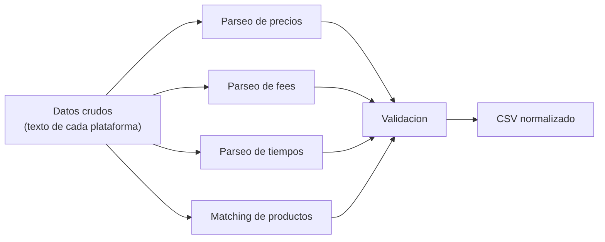

# Reglas de Normalizacion entre Plataformas

## 1. Pipeline de Normalizacion



---

## 2. Parseo de Precios

### Reglas de Conversion texto → float

| Input (texto crudo) | Output (float MXN) | Regla |
|---------------------|---------------------|-------|
| `"$145.00"` | `145.0` | Remover `$`, parsear float |
| `"$89"` | `89.0` | Sin decimales → `.0` |
| `"$ 155.00"` | `155.0` | Remover espacios entre `$` y numero |
| `"MXN 79.00"` | `79.0` | Remover prefijo de moneda |
| `"139-149"` | `139.0` | Rango → tomar el minimo |
| `"Desde $95.00"` | `95.0` | Remover "Desde" |
| `"$129.00 $155.00"` | `129.0` | Dos precios → tomar el menor (precio con descuento) |
| `""` o `null` | `None` | Vacio → null, NO cero |
| `"No disponible"` | `None` | Texto no numerico → null |
| `"Gratis"` | `0.0` | Solo aplica a fees, NO a precios de producto |

### Implementacion

```python
import re

def parse_price(text: str | None) -> float | None:
    """Convierte texto de precio a float MXN.
    
    Estrategia:
    1. Intentar regex para patrones conocidos
    2. Si falla, limpiar y parsear
    3. Si falla, retornar None
    """
    if not text or not text.strip():
        return None
    
    text = text.strip()
    
    # Caso especial: "Gratis" (solo para fees)
    if text.lower() in ("gratis", "envio gratis", "envío gratis", "free", "$0", "$0.00"):
        return 0.0
    
    # Caso especial: "No disponible" y similares
    if any(kw in text.lower() for kw in ("no disponible", "agotado", "n/a")):
        return None
    
    # Extraer todos los numeros con decimales del texto
    numbers = re.findall(r'(\d[\d,]*\.?\d*)', text.replace(",", ""))
    
    if not numbers:
        return None
    
    # Si hay multiples numeros, tomar el menor (precio con descuento)
    prices = [float(n) for n in numbers]
    return min(prices)
```

### Validacion de Precios

```
Reglas de rango:
  - Producto: $1.00 - $1,000.00 MXN (fuera de rango → marcar como sospechoso)
  - Fee: $0.00 - $200.00 MXN
  
Datos de referencia del spike:
  - Big Mac: $145 (Uber) - $155 (Rappi) → rango esperado $89-$180
  - McNuggets 10pz: $145 (Rappi) - $155 (Uber) → rango esperado $100-$200
  - Delivery fee: $0 (Rappi promo) - $4.99 (Uber) → rango esperado $0-$100
```

---

## 3. Parseo de Fees

### Reglas Especificas por Plataforma

| Plataforma | Texto crudo | delivery_fee | Notas |
|------------|-------------|-------------|-------|
| **Rappi** | `"Envio Gratis"` | `0.0` | Promo nuevos usuarios, capturar en `promotions` |
| **Rappi** | `"Envío $29"` | `29.0` | Fee normal |
| **Rappi** | `"Envío gratis comprando +$149"` | `0.0` | Condicional, capturar texto completo en `promotions` |
| **Uber Eats** | `"$4.99 Delivery Fee"` | `4.99` | Spike verificado |
| **Uber Eats** | `"$0 Delivery Fee"` | `0.0` | Promo |
| **Uber Eats** | `"Delivery Fee varies"` | `None` | No determinable → null |
| **DiDi Food** | Por verificar | - | Pendiente spike |

### Service Fee: Siempre null

```
REGLA: service_fee = None para todas las plataformas.
RAZON: No es accesible sin simular compra (ver ADR-003).
EXCEPCION: Si API interception (Capa 1) captura un endpoint de checkout
           que incluya service fee, se puede llenar oportunisticamente.
           Pero NO se navega al checkout para obtenerlo.
```

### Parseo de Promociones

```python
def parse_promotions(elements: list[str]) -> list[str]:
    """Extrae promociones de textos visibles en la pagina.
    
    Patrones conocidos:
    - "Hasta 64% OFF imperdible" → capturar completo
    - "Envio Gratis" → capturar + marcar delivery_fee = 0
    - "2x1 en..." → capturar completo
    - "Descuento $30" → capturar completo
    """
    promotions = []
    promo_keywords = [
        "gratis", "free", "off", "descuento", "2x1", "3x2",
        "promo", "oferta", "ahorra", "especial", "cupón", "cupon"
    ]
    for text in elements:
        text_lower = text.strip().lower()
        if any(kw in text_lower for kw in promo_keywords):
            promotions.append(text.strip())
    return promotions
```

---

## 4. Parseo de Tiempos de Entrega

### Reglas de Conversion texto → (min_minutes, max_minutes)

| Input (texto crudo) | min_minutes | max_minutes | Regla |
|---------------------|-------------|-------------|-------|
| `"35 min"` | `35` | `35` | Un solo valor → min = max |
| `"25-35 min"` | `25` | `35` | Rango explicito |
| `"25 - 35 min"` | `25` | `35` | Rango con espacios |
| `"20-30 minutos"` | `20` | `30` | "minutos" = "min" |
| `"Llega en 35 min"` | `35` | `35` | Prefijo ignorado |
| `"35-45"` | `35` | `45` | Sin sufijo "min" |
| `""` o no visible | `None` | `None` | No disponible |

### Implementacion

```python
import re

def parse_delivery_time(text: str | None) -> tuple[int | None, int | None]:
    """Convierte texto de tiempo de entrega a (min_minutes, max_minutes)."""
    if not text or not text.strip():
        return (None, None)
    
    # Buscar patron "N-M" (rango)
    range_match = re.search(r'(\d+)\s*[-–]\s*(\d+)', text)
    if range_match:
        return (int(range_match.group(1)), int(range_match.group(2)))
    
    # Buscar un solo numero
    single_match = re.search(r'(\d+)', text)
    if single_match:
        value = int(single_match.group(1))
        return (value, value)
    
    return (None, None)
```

### Validacion de Tiempos

```
Rango valido: 5 - 120 minutos
  - < 5 min: sospechoso (error de parseo?)
  - > 120 min: sospechoso (probablemente no es tiempo de entrega)
  
Datos de referencia del spike:
  - Rappi McDonald's: 35 min (visible sin direccion)
  - Uber Eats: requiere direccion, no verificado en spike
```

---

## 5. Matching de Productos: Estrategia en 2 Pasos

### Paso 1: Lookup de Aliases (rapido, sin LLM)

```python
# Primero intentar match exacto/alias desde products.json
PRODUCT_ALIASES = {
    "Big Mac": ["big mac", "bigmac", "big mac tocino", "big mac individual", "big mac sola"],
    "McNuggets 10 pzas": ["mcnuggets 10", "nuggets 10", "chicken mcnuggets 10", "10 mcnuggets", "mcnuggets 10 pzas", "mcnuggets 10 piezas"],
    "Combo Mediano": ["mctrio mediano", "mctrio", "combo big mac", "mctrio hamb c/queso", "mctrio hamb dbl"],
    "Coca-Cola 600ml": ["coca-cola 600", "coca cola 600", "coca-cola mediana", "refresco coca"],
    "Agua Bonafont 1L": ["agua bonafont", "bonafont 1l", "bonafont 1 litro", "agua natural 1l"],
}

def match_by_alias(original_name: str) -> str | None:
    """Match rapido por alias. Retorna canonical_name o None."""
    name_lower = original_name.strip().lower()
    for canonical, aliases in PRODUCT_ALIASES.items():
        if name_lower in aliases or canonical.lower() in name_lower:
            return canonical
    return None
```

### Paso 2: Embedding Similarity (solo si alias falla)

```python
def match_by_embedding(original_name: str, threshold: float = 0.85) -> str | None:
    """Match semantico con nomic-embed-text. Solo se llama si alias falla."""
    original_embedding = ollama_client.embed("nomic-embed-text", original_name)
    
    best_match = None
    best_score = 0.0
    
    for canonical in PRODUCT_ALIASES.keys():
        canonical_embedding = ollama_client.embed("nomic-embed-text", canonical)
        score = cosine_similarity(original_embedding, canonical_embedding)
        if score > best_score:
            best_score = score
            best_match = canonical
    
    if best_score >= threshold:
        return best_match
    return None
```

### Paso 3: Fallback Manual

```python
def match_product(original_name: str) -> str:
    """Pipeline completo de matching."""
    # Paso 1: alias (rapido, sin LLM)
    match = match_by_alias(original_name)
    if match:
        return match
    
    # Paso 2: embedding (mas lento, usa Ollama)
    match = match_by_embedding(original_name)
    if match:
        return match
    
    # Paso 3: no match → usar nombre original como canonical
    # Loguear warning para revision manual
    logger.warning(f"No match for '{original_name}', using as-is")
    return original_name
```

### Cuando se Ejecuta el Matching

```
Matching se ejecuta en DataNormalizer, DESPUES del scraping:
  1. Todos los ScrapedResult se recolectan
  2. Para cada item.original_name:
     a. match_by_alias() → si match, usar canonical
     b. Si no, match_by_embedding() → si match, usar canonical  
     c. Si no, usar original_name (log warning)
  3. El canonical_name se usa en el CSV final
  
NO se ejecuta durante el scraping (no bloquea el loop principal).
Embeddings se cachean en memoria para no llamar Ollama repetidamente.
```

---

## 6. Normalizacion Especifica por Plataforma

### Rappi

```
URL pattern:    rappi.com.mx/restaurantes/{id_numerico}-{nombre_slug}
Precios:        "$155.00" → textos con $ y decimales
Fees:           "Envío Gratis" (promo) o "Envío $XX"
Tiempos:        "35 min" (visible sin direccion)
Promotions:     Badges en la tarjeta: "Hasta 64% OFF", "Envío gratis"
Rating:         "4.1" (numero con 1 decimal)
Particularidad: Styled Components → selectores con hash, preferir API interception
```

### Uber Eats

```
URL pattern:    ubereats.com/mx/store/{nombre_slug}/{hash_id}
Precios:        "$145.00" → textos con $ y decimales  
Fees:           "$4.99 Delivery Fee" o "$0 Delivery Fee"
Tiempos:        Requiere direccion configurada para aparecer
Promotions:     Menos visibles sin scroll
Rating:         "4.5 (25,000+ ratings)" → extraer solo el numero
Particularidad: React SPA, Arkose anti-bot, API interception es prioridad
```

### DiDi Food

```
URL pattern:    didi-food.com/es-MX/food/store/{id_numerico}/{nombre}/
Precios:        Por verificar (SPA no renderiza sin JS)
Fees:           Por verificar
Tiempos:        Por verificar
Promotions:     Por verificar
Rating:         Por verificar
Particularidad: SPA vanilla pesada, posible login, localStorage para direccion
                Capa 3 (vision) es probablemente la mas viable
```

---

## 7. Reglas de Validacion Post-Normalizacion

### Validacion por Campo

| Campo | Tipo | Rango Valido | Accion si Invalido |
|-------|------|-------------|-------------------|
| `price_mxn` | float | 1.0 - 1,000.0 | Marcar `_suspect=True`, no descartar |
| `delivery_fee_mxn` | float | 0.0 - 200.0 | Marcar `_suspect=True` |
| `service_fee_mxn` | float | Siempre null | Aceptar null |
| `delivery_time_min` | int | 5 - 120 | Marcar `_suspect=True` |
| `delivery_time_max` | int | 5 - 120 | Marcar `_suspect=True` |
| `rating` | float | 0.0 - 5.0 | Marcar `_suspect=True` |
| `canonical_product` | str | En lista de 5 productos | Warning si no matchea |

### Validacion de Completitud por ScrapedResult

```
COMPLETO:     ≥4 de 5 productos encontrados + delivery_fee + tiempo entrega
PARCIAL:      1-3 productos encontrados O falta fee O falta tiempo
FALLIDO:      0 productos encontrados

Regla: Resultados PARCIALES se incluyen en el CSV.
       Resultados FALLIDOS se incluyen con success=False.
       NUNCA descartar datos: mejor tener datos incompletos que no tener.
```

### Deduplicacion

```
Si el mismo producto aparece multiples veces para la misma 
(plataforma, direccion, restaurante), tomar el PRIMER resultado.

Clave de deduplicacion:
  (platform, address_label, restaurant, canonical_product)

Si hay duplicados de diferente capa (ej: api + dom para el mismo dato),
preferir en orden: api > dom > text_llm > vision
```
