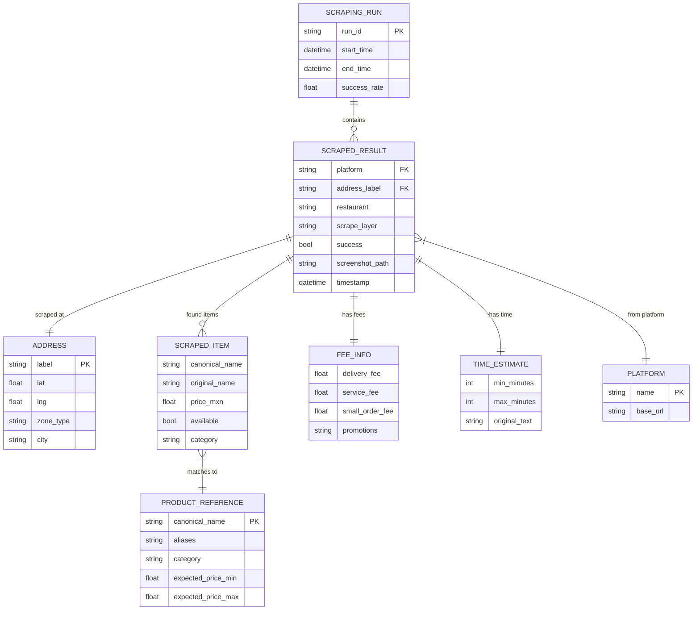

# Schemas y Modelos de Datos

## 1. Modelos Pydantic (desarrollo/src/models/schemas.py)

### Address - Direccion de entrega

```python
from pydantic import BaseModel, Field
from enum import Enum
from datetime import datetime


class ZoneType(str, Enum):
    CENTRO = "centro"
    PREMIUM = "premium"
    RESIDENCIAL = "residencial"
    PERIFERIA = "periferia"
    CORPORATIVO = "corporativo"
    EXPANSION = "expansion"


class Address(BaseModel):
    """Direccion de entrega para scraping."""
    label: str = Field(..., description="Nombre descriptivo: 'Reforma 222 - Centro Historico'")
    lat: float = Field(..., ge=-90, le=90, description="Latitud")
    lng: float = Field(..., ge=-180, le=180, description="Longitud")
    zone_type: ZoneType = Field(..., description="Tipo de zona geografica")
    city: str = Field(default="CDMX", description="Ciudad")
    full_address: str | None = Field(default=None, description="Direccion completa para input en plataforma")
```

### Platform - Plataforma de delivery

```python
class Platform(str, Enum):
    RAPPI = "rappi"
    UBER_EATS = "uber_eats"
    DIDI_FOOD = "didi_food"
```

### StoreType - Tipo de tienda (ADR-004)

```python
class StoreType(str, Enum):
    RESTAURANT = "restaurant"      # McDonald's, Burger King, etc.
    CONVENIENCE = "convenience"    # Oxxo, 7-Eleven, Rappi Turbo
    PHARMACY = "pharmacy"          # Farmacias del Ahorro, Rappi Farmacia
```

### StoreGroup - Grupo de productos por tipo de tienda

```python
class StoreGroup(BaseModel):
    """Agrupa productos por tipo de tienda donde buscarlos."""
    store_type: StoreType
    store_name: str | None = Field(default=None, description="Nombre target: 'McDonald\\'s', 'Oxxo', None=primera disponible")
    store_aliases: list[str] = Field(default_factory=list, description="Aliases para buscar la tienda")
    products: list[ProductReference] = Field(..., description="Productos a buscar en esta tienda")
```

### ProductReference - Producto de referencia (config)

```python
class ProductReference(BaseModel):
    """Producto de referencia para buscar en las plataformas."""
    canonical_name: str = Field(..., description="Nombre canonico: 'Big Mac'")
    aliases: list[str] = Field(default_factory=list, description="Nombres alternativos para matching")
    category: str = Field(..., description="fast_food | retail | pharmacy")
    expected_price_range: dict = Field(..., description="{'min': 89, 'max': 180}")
```

### ScrapedItem - Producto extraido

```python
class ScrapedItem(BaseModel):
    """Un producto extraido de una plataforma."""
    name: str = Field(..., description="Nombre normalizado: 'Big Mac'")
    original_name: str = Field(..., description="Nombre como aparece en la plataforma: 'Big Mac Tocino'")
    price: float = Field(..., gt=0, le=10000, description="Precio en MXN")
    currency: str = Field(default="MXN")
    available: bool = Field(default=True, description="Si el producto esta disponible")
    category: str | None = Field(default=None, description="Categoria: 'fast_food', 'retail'")
    
    # Datos de referencia del spike:
    # Uber Eats McDonald's Polanco: Big Mac $145, McNuggets 10pz $155, Papas grandes $79
    # Rappi McDonald's Alvaro Obregon: Big Mac Tocino $155, McNuggets 10pz $145, Papas grandes $75
```

### FeeInfo - Informacion de fees

```python
class FeeInfo(BaseModel):
    """Fees asociados a un pedido."""
    delivery_fee: float | None = Field(default=None, ge=0, description="Fee de envio en MXN")
    service_fee: float | None = Field(default=None, ge=0, description="Service fee (raramente visible)")
    small_order_fee: float | None = Field(default=None, ge=0, description="Fee por pedido minimo")
    promotions: list[str] = Field(default_factory=list, description="Promociones activas")
    delivery_fee_original: str | None = Field(default=None, description="Texto original: 'Envio Gratis', '$4.99'")
    
    # Datos de referencia del spike:
    # Uber Eats: delivery_fee=$4.99, service_fee=NO VISIBLE (solo en checkout)
    # Rappi: delivery_fee=$0 (promo "Envio Gratis"), service_fee=NO VISIBLE
    # DiDi Food: NO VERIFICADO
```

### TimeEstimate - Tiempo de entrega

```python
class TimeEstimate(BaseModel):
    """Estimacion de tiempo de entrega."""
    min_minutes: int | None = Field(default=None, ge=0, le=180, description="Tiempo minimo en minutos")
    max_minutes: int | None = Field(default=None, ge=0, le=180, description="Tiempo maximo en minutos")
    original_text: str | None = Field(default=None, description="Texto original: '25-35 min'")
    
    # Datos de referencia del spike:
    # Rappi: 35 min visible sin direccion
    # Uber Eats: requiere direccion para ver tiempo
```

### ScrapeLayer - Capa de recoleccion utilizada

```python
class ScrapeLayer(str, Enum):
    API = "api"              # Capa 1: API interception
    DOM = "dom"              # Capa 2: DOM parsing con selectores
    TEXT_LLM = "text_llm"    # Capa 2 fallback: qwen3.5:4b parseo texto
    VISION = "vision"        # Capa 3: screenshot + qwen3-vl OCR
    MANUAL = "manual"        # Datos ingresados manualmente (backup)
```

### ScrapedResult - Resultado completo de un scraping

```python
class ScrapedResult(BaseModel):
    """Resultado completo de scrapear 1 tienda en 1 direccion en 1 plataforma."""
    platform: Platform
    address: Address
    store_type: StoreType = Field(..., description="restaurant | convenience | pharmacy")
    store_name: str = Field(..., description="Nombre de la tienda: 'McDonald\\'s', 'Oxxo'")
    store_id: str | None = Field(default=None, description="ID en la plataforma")
    store_url: str | None = Field(default=None, description="URL scrapeada")
    items: list[ScrapedItem] = Field(default_factory=list)
    fees: FeeInfo = Field(default_factory=FeeInfo)
    time_estimate: TimeEstimate = Field(default_factory=TimeEstimate)
    rating: float | None = Field(default=None, ge=0, le=5, description="Rating del restaurante")
    
    # Metadata
    timestamp: datetime = Field(default_factory=datetime.now)
    scrape_layer: ScrapeLayer = Field(..., description="Que capa de recoleccion se uso")
    success: bool = Field(default=True)
    error_message: str | None = Field(default=None)
    screenshot_path: str | None = Field(default=None, description="Ruta al screenshot de evidencia")
    scrape_duration_seconds: float | None = Field(default=None, description="Tiempo que tomo el scraping")
```

### ScrapingRun - Ejecucion completa

```python
class ScrapingRun(BaseModel):
    """Metadata de una ejecucion completa de scraping."""
    run_id: str = Field(..., description="UUID de la ejecucion")
    start_time: datetime
    end_time: datetime | None = None
    platforms: list[Platform]
    addresses_count: int
    products_target: list[str]
    results: list[ScrapedResult] = Field(default_factory=list)
    
    @property
    def success_rate(self) -> float:
        if not self.results:
            return 0.0
        return sum(1 for r in self.results if r.success) / len(self.results)
    
    @property
    def layer_distribution(self) -> dict[str, int]:
        dist: dict[str, int] = {}
        for r in self.results:
            layer = r.scrape_layer.value
            dist[layer] = dist.get(layer, 0) + 1
        return dist
```

---

## 2. Schema JSON de Salida por Plataforma

Archivo: `data/raw/{platform}_{YYYY-MM-DD}_{HH-MM-SS}.json`

```json
{
  "run_id": "a1b2c3d4-e5f6-7890-abcd-ef1234567890",
  "platform": "rappi",
  "timestamp": "2026-04-07T14:30:00",
  "scraping_config": {
    "addresses_count": 25,
    "products_target": ["Big Mac", "McNuggets 10 pzas", "Combo Mediano", "Coca-Cola 600ml", "Agua Bonafont 1L"],
    "restaurant": "McDonald's"
  },
  "results": [
    {
      "platform": "rappi",
      "address": {
        "label": "Reforma 222 - Centro Historico",
        "lat": 19.4326,
        "lng": -99.1332,
        "zone_type": "centro",
        "city": "CDMX"
      },
      "store_type": "restaurant",
      "store_name": "McDonald's",
      "store_id": "1306705702",
      "store_url": "https://rappi.com.mx/restaurantes/1306705702-mcdonalds",
      "items": [
        {
          "name": "Big Mac",
          "original_name": "Big Mac Tocino",
          "price": 155.00,
          "currency": "MXN",
          "available": true,
          "category": "fast_food"
        },
        {
          "name": "McNuggets 10 pzas",
          "original_name": "McNuggets 10 pzas",
          "price": 145.00,
          "currency": "MXN",
          "available": true,
          "category": "fast_food"
        }
      ],
      "fees": {
        "delivery_fee": 0.0,
        "service_fee": null,
        "small_order_fee": null,
        "promotions": ["Envio Gratis", "Hasta 64% OFF imperdible"],
        "delivery_fee_original": "Envio Gratis"
      },
      "time_estimate": {
        "min_minutes": 35,
        "max_minutes": 35,
        "original_text": "35 min"
      },
      "rating": 4.1,
      "timestamp": "2026-04-07T14:30:15",
      "scrape_layer": "dom",
      "success": true,
      "error_message": null,
      "screenshot_path": "data/screenshots/rappi_reforma222_20260407_143015.png",
      "scrape_duration_seconds": 8.3
    }
  ],
  "summary": {
    "total_addresses": 25,
    "successful": 23,
    "failed": 2,
    "success_rate": 0.92,
    "layer_distribution": {
      "api": 15,
      "dom": 6,
      "vision": 2
    },
    "avg_scrape_duration_seconds": 7.5
  }
}
```

---

## 3. Schema del CSV Consolidado

Archivo: `data/merged/comparison.csv`

| Columna | Tipo | Ejemplo | Descripcion |
|---------|------|---------|-------------|
| `timestamp` | datetime | 2026-04-07T14:30:15 | Momento del scraping |
| `run_id` | string | a1b2c3d4... | ID de la ejecucion |
| `platform` | string | rappi | rappi, uber_eats, didi_food |
| `address_label` | string | Reforma 222 - Centro | Nombre de la direccion |
| `lat` | float | 19.4326 | Latitud |
| `lng` | float | -99.1332 | Longitud |
| `zone_type` | string | centro | centro, premium, residencial, periferia, corporativo |
| `city` | string | CDMX | Ciudad |
| `store_type` | string | restaurant | restaurant, convenience, pharmacy |
| `store_name` | string | McDonald's | Nombre de la tienda |
| `store_id` | string | 1306705702 | ID en la plataforma |
| `canonical_product` | string | Big Mac | Nombre normalizado del producto |
| `product_category` | string | fast_food | fast_food, retail, pharmacy |
| `original_product_name` | string | Big Mac Tocino | Nombre original en la plataforma |
| `price_mxn` | float | 155.00 | Precio en MXN |
| `available` | bool | True | Disponibilidad del producto |
| `delivery_fee_mxn` | float | 0.00 | Fee de envio en MXN |
| `service_fee_mxn` | float | null | Service fee (generalmente null) |
| `delivery_time_min` | int | 35 | Tiempo minimo de entrega (min) |
| `delivery_time_max` | int | 35 | Tiempo maximo de entrega (min) |
| `promotions` | string | "Envio Gratis;64% OFF" | Promociones separadas por ; |
| `rating` | float | 4.1 | Rating del restaurante |
| `scrape_layer` | string | dom | api, dom, text_llm, vision |
| `screenshot_path` | string | data/screenshots/... | Ruta al screenshot |

### Ejemplo CSV (datos reales del spike)

```csv
timestamp,platform,address_label,zone_type,city,restaurant,canonical_product,original_product_name,price_mxn,available,delivery_fee_mxn,service_fee_mxn,delivery_time_min,delivery_time_max,promotions,rating,scrape_layer
2026-04-07T14:30:15,rappi,Reforma 222,centro,CDMX,McDonald's,Big Mac,Big Mac Tocino,155.00,True,0.00,,35,35,Envio Gratis;Hasta 64% OFF,4.1,dom
2026-04-07T14:30:15,uber_eats,Reforma 222,centro,CDMX,McDonald's,Big Mac,Big Mac,145.00,True,4.99,,25,35,,4.5,api
2026-04-07T14:30:15,rappi,Reforma 222,centro,CDMX,McDonald's,McNuggets 10 pzas,McNuggets 10 pzas,145.00,True,0.00,,35,35,Envio Gratis,4.1,dom
2026-04-07T14:30:15,uber_eats,Reforma 222,centro,CDMX,McDonald's,McNuggets 10 pzas,McNuggets 10 pzas,155.00,True,4.99,,25,35,,4.5,api
2026-04-07T14:30:15,rappi,Reforma 222,centro,CDMX,McDonald's,Papas grandes,Papas grandes,75.00,True,0.00,,35,35,Envio Gratis,4.1,dom
2026-04-07T14:30:15,uber_eats,Reforma 222,centro,CDMX,McDonald's,Papas grandes,Papas grandes,79.00,True,4.99,,25,35,,4.5,api
```

---

## 4. Schemas de Configuracion

### addresses.json

```json
{
  "$schema": "Definicion de direcciones para scraping",
  "addresses": [
    {
      "label": "Reforma 222 - Centro Historico",
      "lat": 19.4326,
      "lng": -99.1332,
      "zone_type": "centro",
      "city": "CDMX",
      "full_address": "Paseo de la Reforma 222, Juarez, Cuauhtemoc, 06600 CDMX"
    },
    {
      "label": "Polanco - Zona Premium",
      "lat": 19.4340,
      "lng": -99.1956,
      "zone_type": "premium",
      "city": "CDMX",
      "full_address": "Av. Presidente Masaryk 360, Polanco, 11560 CDMX"
    },
    {
      "label": "Coyoacan - Residencial Sur",
      "lat": 19.3467,
      "lng": -99.1617,
      "zone_type": "residencial",
      "city": "CDMX",
      "full_address": "Av. Universidad 1900, Coyoacan, 04310 CDMX"
    },
    {
      "label": "Iztapalapa - Periferia Este",
      "lat": 19.3586,
      "lng": -99.0575,
      "zone_type": "periferia",
      "city": "CDMX",
      "full_address": "Calz. Ermita Iztapalapa 2100, 09300 CDMX"
    },
    {
      "label": "Santa Fe - Corporativo",
      "lat": 19.3663,
      "lng": -99.2586,
      "zone_type": "corporativo",
      "city": "CDMX",
      "full_address": "Av. Santa Fe 440, Santa Fe, 05348 CDMX"
    }
  ]
}
```

### products.json

```json
{
  "$schema": "Productos de referencia para comparacion entre plataformas",
  "restaurant": "McDonald's",
  "products": [
    {
      "canonical_name": "Big Mac",
      "aliases": ["Big Mac", "Big Mac Tocino", "Big Mac Individual", "BigMac"],
      "category": "fast_food",
      "expected_price_range": {"min": 89, "max": 180},
      "notes": "Indice Big Mac es estandar mundial"
    },
    {
      "canonical_name": "McNuggets 10 pzas",
      "aliases": ["McNuggets 10 pzas", "McNuggets 10 piezas", "10 McNuggets", "Chicken McNuggets 10"],
      "category": "fast_food",
      "expected_price_range": {"min": 100, "max": 200},
      "notes": "Producto simple, buen punto de comparacion"
    },
    {
      "canonical_name": "Combo Mediano",
      "aliases": ["McTrio Mediano", "McTrio mediano Big Mac", "Combo Big Mac Mediano", "McTrio Hamb c/Queso"],
      "category": "fast_food",
      "expected_price_range": {"min": 85, "max": 200},
      "notes": "Compara bundling y pricing de combos"
    },
    {
      "canonical_name": "Coca-Cola 600ml",
      "aliases": ["Coca-Cola 600ml", "Coca-Cola mediana", "Coca Cola 600", "Refresco Coca 600ml"],
      "category": "retail",
      "expected_price_range": {"min": 20, "max": 80},
      "notes": "Producto commoditizado, precio deberia ser similar"
    },
    {
      "canonical_name": "Agua Bonafont 1L",
      "aliases": ["Agua Bonafont 1L", "Bonafont 1 litro", "Agua Natural 1L", "Bonafont 1000ml"],
      "category": "retail",
      "expected_price_range": {"min": 10, "max": 50},
      "notes": "Bajo precio, amplifica diferencias en fees"
    }
  ]
}
```

### settings.yaml

```yaml
# Settings generales del sistema
general:
  project_name: "Rappi Competitive Intelligence"
  version: "0.1.0"
  default_city: "CDMX"
  default_restaurant: "McDonald's"

# Configuracion de scraping
scraping:
  platforms:
    - rappi        # Primero: PWA accesible, menos anti-bot
    - uber_eats    # Segundo: bien documentado, mas anti-bot
    - didi_food    # Tercero: SPA pesada, posible login requerido
  
  # Rate limiting
  delay_between_requests_min: 3    # segundos
  delay_between_requests_max: 7    # segundos
  delay_between_addresses_min: 5   # segundos
  delay_between_addresses_max: 10  # segundos
  max_requests_per_minute: 10
  max_concurrent_browsers: 1       # secuencial por seguridad
  
  # Timeouts
  page_load_timeout: 30000         # ms
  selector_timeout: 10000          # ms
  screenshot_timeout: 5000         # ms
  
  # Retries
  max_retries_per_address: 2
  retry_delay: 5                   # segundos

# Configuracion de browser
browser:
  headless: true
  stealth: true
  user_agent: "Mozilla/5.0 (Windows NT 10.0; Win64; x64) AppleWebKit/537.36 (KHTML, like Gecko) Chrome/124.0.0.0 Safari/537.36"
  viewport_width: 1920
  viewport_height: 1080
  locale: "es-MX"
  timezone: "America/Mexico_City"
  geolocation: true

# Configuracion de Ollama (modelos locales)
ollama:
  base_url: "http://localhost:11434"
  models:
    vision: "qwen3-vl:8b"           # Capa 3: OCR de screenshots
    text_parser: "qwen3.5:4b"       # Capa 2 fallback: parseo texto roto
    insights: "qwen3.5:9b"          # Generacion de insights
    embeddings: "nomic-embed-text"   # Matching de productos
  
  # Umbrales
  embedding_similarity_threshold: 0.85  # Para product matching
  vision_confidence_threshold: 0.7      # Confianza minima OCR

# Configuracion de proxy (deshabilitado por defecto)
proxy:
  enabled: false
  provider: "scraperapi"       # o "brightdata", "oxylabs"
  api_key_env: "SCRAPER_API_KEY"
  country: "MX"
  rotate: true

# Rutas de datos
paths:
  raw_data: "data/raw"
  merged_data: "data/merged"
  screenshots: "data/screenshots"
  reports: "reports"
  charts: "reports/charts"

# Logging
logging:
  level: "INFO"                # DEBUG, INFO, WARNING, ERROR
  console: true                # Logs en consola con rich
  file: true                   # Logs en archivo
  file_path: "logs/scraping.log"
```

---

## 5. Diagrama ER de Relaciones


