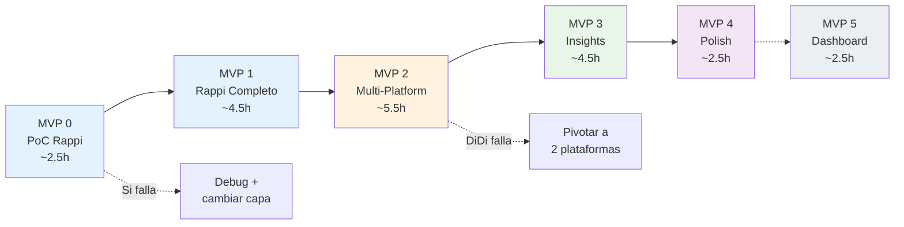

# Plan de MVPs — Estrategia de Ejecucion

> Este documento **supersede** a `Analisis/04-mvp-roadmap.md`.
> Incorpora todas las decisiones del diseno: ADR-001 (Rappi primero),
> ADR-002 (3 capas), ADR-003 (service fee), ADR-004 (retail multi-store).

## Filosofia

Cada MVP es **funcional y entregable por si solo**. Si el tiempo se acaba en cualquier MVP, hay algo que mostrar. El sistema crece incrementalmente: primero datos, luego cobertura, luego insights, luego polish.

```
MVP 0 → "Puedo obtener 1 dato real"
MVP 1 → "Tengo datos de 1 plataforma completa"
MVP 2 → "Tengo datos de 3 plataformas comparados"
MVP 3 → "Tengo insights accionables con graficos"
MVP 4 → "Listo para presentar en 30 minutos"
MVP 5 → "Dashboard interactivo (bonus)"
```

---

## MVP 0: Proof of Concept — Rappi 1 direccion (2-3 horas)

### Objetivo
Validar que las 3 capas de recoleccion funcionan en Rappi con 1 direccion.

### Scope

| Elemento | Valor |
|----------|-------|
| Plataforma | Rappi (ADR-001) |
| Direcciones | 1 (Reforma 222, centro) |
| Productos | 1 (Big Mac en McDonald's) |
| Metricas | Precio + delivery fee |
| Output | Print en consola + JSON |

### Que se construye

```
desarrollo/src/
├── scrapers/
│   ├── __init__.py
│   ├── base.py              ← BaseScraper con logica de 3 capas
│   └── rappi.py             ← RappiScraper (set_address, search_store, extract)
├── models/
│   ├── __init__.py
│   └── schemas.py           ← Address, ScrapedItem, ScrapedResult, FeeInfo
├── utils/
│   ├── __init__.py
│   ├── logger.py            ← Logger con rich
│   └── ollama_client.py     ← Wrapper de Ollama (chat, embed, is_available)
├── config.py                ← Carga settings.yaml, addresses.json, products.json
└── main.py                  ← CLI basico (solo --debug por ahora)
```

### Tareas (en orden)

```
1. [30 min] Scaffolding: crear archivos, __init__.py, imports
2. [30 min] schemas.py: implementar modelos Pydantic del diseno
3. [20 min] config.py: cargar JSON/YAML con validacion basica
4. [20 min] ollama_client.py: wrapper async para Ollama
5. [15 min] logger.py: setup con rich
6. [45 min] base.py: BaseScraper con logica de 3 capas (el corazon)
   - setup/teardown de Playwright
   - try_api_interception → try_dom_parsing → try_vision_fallback
   - take_screenshot, rate_limit_delay
7. [30 min] rappi.py: RappiScraper
   - Abrir rappi.com.mx/restaurantes/1306705702-mcdonalds
   - Verificar selectores CSS reales con DevTools
   - Implementar extract_items, extract_fees, extract_delivery_time
8. [15 min] main.py: CLI con --debug
9. [15 min] Ejecutar y validar: 1 dato real de Rappi
```

### Criterio de exito

```json
{
  "platform": "rappi",
  "store_type": "restaurant",
  "store_name": "McDonald's",
  "address": "Reforma 222 - Centro Historico",
  "items": [{"name": "Big Mac", "price": 155.00}],
  "fees": {"delivery_fee": 0.0},
  "scrape_layer": "api",
  "success": true
}
```

### Decision de corte
- Si Capa 1 (API) funciona en <1 hora → seguir con MVP 1
- Si Capa 1 falla pero Capa 2 (DOM) funciona → seguir con MVP 1
- Si Capas 1 y 2 fallan pero Capa 3 (vision) funciona → seguir, pero ajustar expectativas de velocidad
- Si las 3 capas fallan → revisar, debuggear, no pasar a MVP 1 sin al menos 1 capa funcional

### Branch: `feature/poc-rappi`
### Tag al terminar: `v0.1.0-alpha`

---

## MVP 1: Rappi Multi-Address + Multi-Store (4-5 horas)

### Objetivo
Scraper completo para Rappi: 25 direcciones, 6 productos en 2-3 tipos de tienda.

### Scope

| Elemento | Valor |
|----------|-------|
| Plataforma | Rappi |
| Direcciones | 25 (5 clusters CDMX) |
| Productos | 6: Big Mac + McNuggets + Combo (McDonald's) + Coca-Cola + Agua (Oxxo) + Panales (farmacia) |
| Metricas | Precio, delivery fee, tiempo, promos, disponibilidad |
| Output | JSON raw + CSV |

### Que se construye (adicional a MVP 0)

```
desarrollo/src/
├── scrapers/
│   ├── orchestrator.py      ← ScrapingOrchestrator (loop dirs × stores)
│   ├── vision_fallback.py   ← VisionFallback (qwen3-vl OCR)
│   └── text_parser.py       ← TextParser (qwen3.5:4b fallback)
├── processors/
│   ├── __init__.py
│   ├── normalizer.py        ← DataNormalizer (parseo precios, fees, tiempos)
│   ├── product_matcher.py   ← ProductMatcher (aliases + nomic-embed-text)
│   ├── validator.py         ← DataValidator (rangos, completitud)
│   └── merger.py            ← DataMerger (→ comparison.csv)
└── utils/
    ├── rate_limiter.py      ← Random delays entre requests
    └── screenshot.py        ← Captura y naming de screenshots
```

### Tareas

```
1. [45 min] orchestrator.py: loop por direcciones × store_groups
   - Para cada direccion: McDonald's → Oxxo → Farmacia
   - Rate limiting entre requests
   - Manejo de errores y circuit breaker

2. [30 min] Extender rappi.py: multi-store
   - search_store(RESTAURANT, "McDonald's") → ya funciona de MVP 0
   - search_store(CONVENIENCE, "Oxxo") → navegar a Oxxo o Rappi Turbo
   - search_store(PHARMACY, null) → Rappi Farmacia (si hay tiempo)

3. [30 min] vision_fallback.py + text_parser.py
   - Integrar prompts de prompts-ollama.md
   - Manejo de JSON invalido (clean + retry + regex)

4. [45 min] normalizer.py + product_matcher.py
   - Implementar reglas de normalizacion.md
   - Alias lookup → embedding similarity → fallback

5. [30 min] validator.py + merger.py
   - Validacion de rangos
   - Merge a comparison.csv

6. [30 min] Actualizar main.py
   - Flags: --platforms, --max-addresses, --screenshots, --save-backup

7. [30 min] Run completo: 25 dirs × Rappi × 2-3 stores
   - Verificar output JSON y CSV
   - Ajustar selectores que fallen
   - Documentar que funciona y que no

8. [15 min] Guardar backup: python -m src.main --platforms rappi --save-backup
```

### Criterio de exito
- CSV con ≥100 filas (25 dirs × 3-6 productos × ~70% success rate)
- Al menos 3 metricas completas
- Success rate ≥70%

### Decision de corte
- Si Rappi restaurant funciona pero retail falla → seguir con solo fast food, documentar
- Si success rate <50% → investigar, ajustar selectores/capas antes de seguir
- Si Panales (farmacia) no funciona → documentar como MVP 2+, no bloquea

### Branch: `feature/rappi-scraper`
### Tag al terminar: `v0.1.0`

---

## MVP 2: Multi-Platform (5-6 horas)

### Objetivo
Extender a Uber Eats y DiDi Food. CSV consolidado de 3 plataformas.

### Scope

| Elemento | Valor |
|----------|-------|
| Plataformas | 3: Rappi + Uber Eats + DiDi Food |
| Direcciones | 25 × 3 plataformas |
| Productos | 6 (mismos que MVP 1) |
| Output | JSON raw por plataforma + CSV consolidado |

### Que se construye (adicional a MVP 1)

```
desarrollo/src/scrapers/
├── uber_eats.py             ← UberEatsScraper
└── didi_food.py             ← DiDiFoodScraper
```

### Tareas

```
UBER EATS (3 horas):
1. [30 min] uber_eats.py: scaffold + selectores del diseno
2. [30 min] Abrir ubereats.com/mx con Playwright → verificar selectores reales
3. [15 min] Si Arkose bloquea → decidir: stealth tweak o directo a Capa 3
4. [45 min] Implementar: set_address, search_store, extract_items, extract_fees
5. [30 min] Multi-store: McDonald's + Oxxo/convenience
6. [30 min] Run: 25 dirs × Uber Eats → verificar datos

DIDI FOOD (2 horas):
7. [30 min] didi_food.py: scaffold + localStorage hack para direccion
8. [30 min] Abrir didi-food.com → verificar si funciona o va directo a Capa 3
9. [30 min] Implementar lo que funcione (API, DOM, o solo Vision)
10. [30 min] Run: 25 dirs × DiDi → aceptar cobertura parcial si es necesario

CONSOLIDACION (1 hora):
11. [30 min] Run completo: python -m src.main (3 plataformas)
12. [15 min] Verificar comparison.csv: datos de 3 plataformas alineados
13. [15 min] Backup: python -m src.main --save-backup
```

### Criterio de exito
- CSV con datos de al menos 2 plataformas
- ≥200 filas en comparison.csv
- Datos comparables: mismo producto en ≥2 plataformas para ≥10 direcciones

### Decision de corte
- Si DiDi no funciona despues de 2 horas → pivotar a 2 plataformas
  - Brief dice "priorizar calidad sobre cantidad"
  - 2 plataformas bien scrapeadas > 3 a medias
  - Documentar DiDi como "bloqueado por [razon]" en limitaciones
- Si Uber Eats falla por Arkose → Capa 3 (vision) para todo Uber
  - Mas lento pero funciona
  - Screenshots quedan como evidencia (bonus)

### Branch: `feature/multi-platform`
### Tag al terminar: `v0.2.0`

---

## MVP 3: Insights + Visualizaciones + Reporte (4-5 horas)

### Objetivo
Generar los 5 insights accionables, 4 visualizaciones y reporte HTML.

### Scope

| Elemento | Valor |
|----------|-------|
| Input | comparison.csv de MVP 2 |
| Output | insights.html + charts/ + analysis.ipynb |
| Insights | 5 (1 por cada dimension del brief) |
| Charts | 4 (barras, heatmap, scatter, tabla) |

### Que se construye (adicional a MVP 2)

```
desarrollo/src/analysis/
├── __init__.py
├── insights.py              ← InsightGenerator (qwen3.5:9b)
├── visualizations.py        ← 4 charts con matplotlib
└── report_generator.py      ← HTML autocontenido
```

### Tareas

```
1. [45 min] visualizations.py
   - chart_price_comparison() → barras comparativa
   - chart_zone_heatmap() → heatmap variabilidad por zona
   - chart_fee_vs_time() → scatter fee vs tiempo
   - chart_price_table() → tabla pivot HTML

2. [45 min] insights.py
   - Calcular estadisticas con pandas (promedios, deltas, variabilidad)
   - Preparar inputs del prompt (stats_summary, top_price_deltas, etc.)
   - Llamar qwen3.5:9b con prompt de prompts-ollama.md
   - Parsear y validar 5 insights (1 por dimension)
   - Generar resumen ejecutivo

3. [45 min] report_generator.py
   - Template HTML con secciones de reporte-estructura.md
   - Embeber charts como base64
   - Insertar insights como HTML
   - CSS inline para portabilidad

4. [30 min] Notebook: notebooks/analysis.ipynb
   - Copiar logica de visualizations.py en celdas
   - Agregar analisis exploratorio adicional
   - Verificar que cada celda ejecuta independiente

5. [30 min] Actualizar main.py
   - Integrar InsightGenerator + Visualizations + ReportGenerator al flujo
   - Flag --report-only funcional

6. [30 min] Run completo: python -m src.main
   - Verificar insights.html en browser
   - Ajustar formato, colores, labels de charts
   - Revisar y editar insights generados por LLM si son genericos

7. [15 min] Backup actualizado: python -m src.main --save-backup
```

### Criterio de exito
- insights.html abre en browser y se ve profesional
- 5 insights con datos reales (no genéricos)
- 4 charts legibles con labels correctos
- --report-only genera reporte en <2 min

### Decision de corte
- Si qwen3.5:9b genera insights genericos → editar manualmente (son 5 parrafos)
- Si un chart no tiene datos suficientes (ej: DiDi sin fees) → adaptar a 2 plataformas
- No pasar a MVP 4 sin al menos 3 charts y 5 insights

### Branch: `feature/insights-report`
### Tag al terminar: `v0.3.0`

---

## MVP 4: Polish + Presentacion (2-3 horas)

### Objetivo
Todo listo para la presentacion de 30 minutos.

### Que se hace

```
1. [30 min] README.md principal
   - Usar template de readme-por-mvp.md (MVP 4 version)
   - Quick Start funcional (copiar/pegar y que funcione)
   - Verificar que un evaluador puede clonar + instalar + ejecutar

2. [20 min] README.md en desarrollo/
   - Setup detallado para contribuidores
   - Como correr tests, lint, etc.

3. [30 min] Limpiar codigo
   - Remover prints de debug
   - Agregar docstrings en funciones publicas
   - ruff check + ruff format

4. [30 min] Preparar demo
   - Correr --debug y verificar que funciona en vivo
   - Si falla: tener --use-backup listo
   - Verificar que insights.html esta actualizado

5. [30 min] Preparar presentacion
   - Crear slides basados en diseno/presentacion/estructura.md
   - Insertar charts de reports/charts/
   - Ensayar timing (20 min presentacion)

6. [15 min] Verificacion final
   - Correr pytest (lo que haya)
   - Correr ruff check
   - Verificar .gitignore (no commitear .env, data/, logs/)
   - git tag v0.4.0
```

### Criterio de exito
- `git clone` + `pip install` + `python -m src.main --debug` funciona
- Presentacion cubre los 30 minutos
- Datos pre-scrapeados listos como backup
- README claro para el evaluador

### Branch: `release/v0.4.0`
### Tag al terminar: `v0.4.0`

---

## MVP 5: Dashboard Streamlit (Bonus, 2-3 horas)

### Solo si MVPs 0-4 estan completos y hay tiempo

```
desarrollo/src/dashboard/
├── __init__.py
└── app.py                  ← Streamlit app

# Ejecutar:
streamlit run src/dashboard/app.py
```

Features:
- Selector de zona/plataforma/producto
- Charts interactivos con plotly
- Tabla de datos raw filtrable
- Score competitivo por zona

### Branch: `feature/dashboard`
### Tag: `v0.5.0`

---

## Timeline: 2 Dias

```
DIA 1 (~10 horas)
═══════════════════════════════════════════════════

09:00 ─ 11:30  MVP 0: PoC Rappi (scaffolding + 1 dato real)
               ├─ schemas.py, config.py, logger.py
               ├─ base.py (3 capas), rappi.py
               └─ Validar: 1 dato de McDonald's Rappi ✓

11:30 ─ 12:00  Pausa + evaluar: ¿que capa funciono? ajustar plan

12:00 ─ 17:00  MVP 1: Rappi completo
               ├─ orchestrator.py (loop dirs × stores)
               ├─ rappi.py multi-store (McDonald's + Oxxo)
               ├─ normalizer.py, product_matcher.py, merger.py
               └─ Run: 25 dirs × Rappi → comparison.csv parcial ✓

17:00 ─ 19:00  MVP 2 (inicio): Uber Eats
               ├─ uber_eats.py scaffold + verificar selectores
               ├─ Si Arkose → Capa 3 directo
               └─ Run: primeras 5-10 dirs de Uber ✓

               → Al final del Dia 1: Datos de Rappi completos + Uber parcial


DIA 2 (~10 horas)
═══════════════════════════════════════════════════

09:00 ─ 11:00  MVP 2 (cont): Completar Uber + DiDi
               ├─ Uber Eats: 25 dirs restantes
               ├─ DiDi Food: intentar, aceptar cobertura parcial
               └─ comparison.csv completo ✓

11:00 ─ 11:30  Backup: python -m src.main --save-backup

11:30 ─ 15:30  MVP 3: Insights + Reporte
               ├─ visualizations.py (4 charts)
               ├─ insights.py (5 insights con qwen3.5:9b)
               ├─ report_generator.py (HTML)
               └─ insights.html listo ✓

15:30 ─ 18:00  MVP 4: Polish
               ├─ README.md
               ├─ Limpiar codigo, ruff format
               ├─ Preparar presentacion
               └─ Verificacion final ✓

18:00 ─ 19:00  Buffer
               ├─ Arreglar lo que falle
               ├─ Ensayar presentacion
               └─ Backup final

               → Al final del Dia 2: LISTO PARA PRESENTAR
```

---

## Reglas de Ejecucion

### 1. Nunca avanzar de MVP sin criterio de exito
Si MVP 0 no produce 1 dato real → no empezar MVP 1. Arreglar primero.

### 2. Priorizar datos sobre features
Mejor tener datos reales de 2 plataformas que un sistema elegante sin datos.

### 3. Decision de corte agresiva
- DiDi Food no funciona en 2 horas → documentar, seguir con 2 plataformas
- Farmacia (panales) no funciona → documentar, seguir con fast food + retail
- Un chart no tiene datos suficientes → adaptar o eliminar

### 4. Siempre tener backup
Despues de cada MVP exitoso: `--save-backup`. El dato de ayer es mejor que no tener dato.

### 5. El README se actualiza en cada MVP
Usar templates de `diseno/documentacion/readme-por-mvp.md`.

### 6. Branch discipline
```
main ← solo tags (v0.1.0, v0.2.0...)
├── develop ← merge cada MVP completado
│   ├── feature/poc-rappi      ← MVP 0
│   ├── feature/rappi-scraper  ← MVP 1
│   ├── feature/multi-platform ← MVP 2
│   ├── feature/insights-report← MVP 3
│   └── release/v0.4.0        ← MVP 4
└── feature/dashboard          ← MVP 5 (bonus)
```

---

## Mapa de Dependencias


